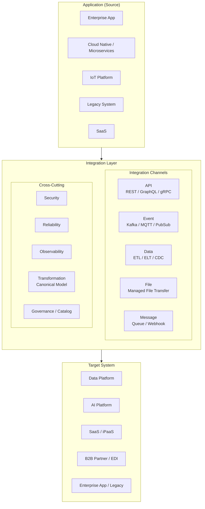
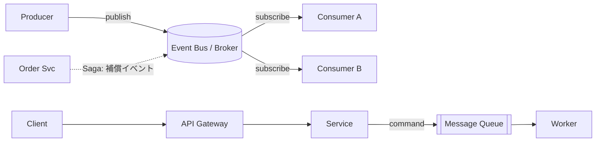
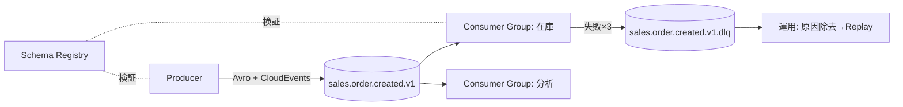
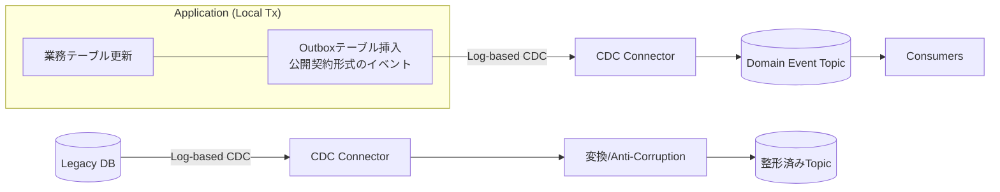
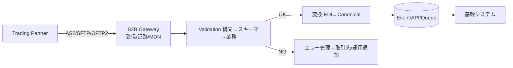
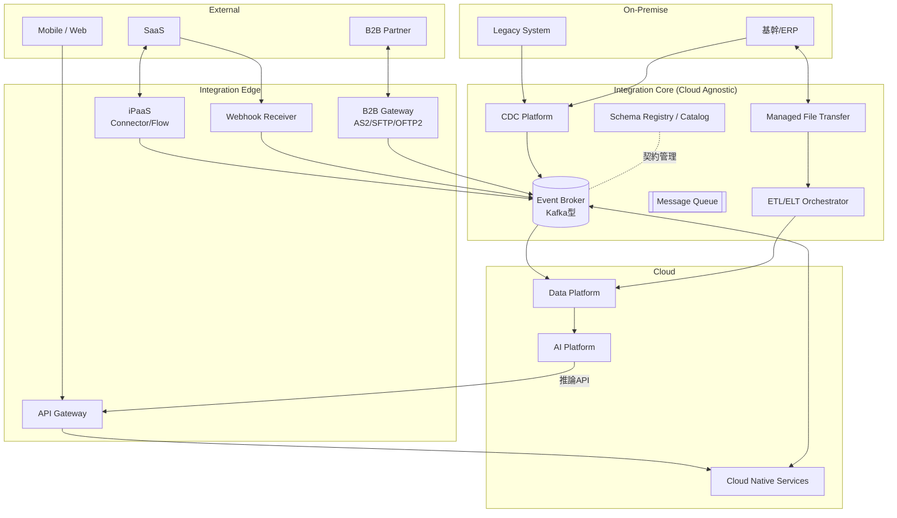
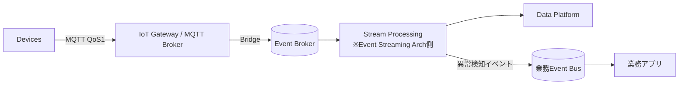

# Enterprise Integration Architecture Framework 設計書

Version 1.0 | Cloud Agnostic | 10年以上の利用を前提としたEnterprise Integration標準フレームワーク

設計思想: API First / Event First / Loose Coupling / Contract First / Asynchronous First / Observable Integration / Secure Integration / Reusable Integration / Standardization / Evolutionary Architecture

---

# 1. 要件定義

## 1.1 Enterprise Integrationとは
企業内外の全システム(Enterprise Application、Cloud Native、AI Platform、IoT Platform、Data Platform、SaaS、On-Premise、Legacy)間の**システム間連携・データ連携・イベント連携・リアルタイム連携・バッチ連携・クラウド連携・SaaS連携・B2B連携**を、統一されたアーキテクチャ原則・パターン・ガバナンスの下で設計・運用する規律である。個別のAPI設計ではなく、**連携全体を1つのアーキテクチャ資産として管理する枠組み**を指す。

## 1.2 目的
- 連携方式の標準化により、開発速度・再利用性・保守性を向上させる
- Point-to-Point乱立(スパゲッティ連携)を防止し、連携の全体可視性を確保する
- 同期/非同期/バッチ/ファイル/B2Bを統一原則で扱い、方式選定を体系化する
- 契約(Contract)駆動により、システム間の疎結合と独立進化を実現する
- 10年以上、技術・製品の変化に耐える進化可能な連携基盤を定義する

## 1.3 背景
- SaaS・クラウド・AI・IoTの普及により連携対象と連携方式が爆発的に増加
- Legacy(ホスト・EDI・ファイル連携)とCloud Native(API・イベント)の併存が常態化
- 連携が個別最適で作られ、変更影響が把握できず障害・コスト増を招いている
- リアルタイム要求(在庫、決済、IoT、AI推論)とバッチ処理の混在が進行

## 1.4 解決する課題
| 課題 | 本フレームワークによる解決 |
|---|---|
| 連携方式が案件ごとにバラバラ | Integration Style Catalog + 採用基準で標準化 |
| P2P乱立で影響分析不能 | Hub型/イベント型パターン + Integration Catalog |
| 密結合による変更困難 | Contract First + Canonical Model + 疎結合原則 |
| 障害連鎖・データ欠損 | Reliability Architecture(Retry/DLQ/Replay) |
| 連携のブラックボックス化 | Observability(Correlation ID/Tracing/Audit) |
| セキュリティ実装の不統一 | Security Architecture(OAuth2/mTLS/暗号化)標準 |
| 変更・廃止の統制欠如 | Integration Governance(Lifecycle/Ownership) |

## 1.5 対象範囲
- 同期API連携(REST/GraphQL/gRPC)、非同期イベント連携(Kafka/MQTT/Pub-Sub/Webhook)
- バッチ・ETL/ELT・CDC・ファイル連携、SaaS/iPaaS連携、B2B/EDI連携
- 連携横断の共通機能: セキュリティ、信頼性、可観測性、データ変換、ガバナンス

## 1.6 利用シナリオ
| シナリオ | 代表方式 |
|---|---|
| 基幹系とSaaS(CRM/ERP)のマスタ同期 | CDC + Event / iPaaS |
| ECの注文をリアルタイムで在庫・物流へ伝搬 | Event(Kafka) + Saga |
| IoTデバイスのテレメトリ収集と分析基盤連携 | MQTT → Streaming → Data Platform |
| AIプラットフォームへの学習データ供給/推論API公開 | Batch/CDC + REST/gRPC |
| 取引先との受発注ドキュメント交換 | EDI(AS2/SFTP) + 変換 |
| 月次会計・請求の大量データ処理 | Batch/ETL + File Transfer |
| モバイル/Webフロントへの統合API提供 | API Gateway + REST/GraphQL |

## 1.7 対象利用者
Integration Architect、Solution/Data/Cloud Architect、アプリ開発チーム、Platform/SREチーム、セキュリティ部門、B2B運用チーム、IT企画・ガバナンス部門。

## 1.8 品質目標
| 品質特性 | 目標 |
|---|---|
| 相互運用性 | 標準プロトコル・標準フォーマットのみ採用(製品非依存) |
| 可用性 | 連携基盤 99.9〜99.99%(Tier別、18章) |
| 変更容易性 | 契約互換性ルールにより、片側変更でリリース可能 |
| 再利用性 | 連携部品(Connector/変換/共通契約)の再利用率50%以上 |
| 追跡性 | 全連携にCorrelation ID付与、E2E追跡100% |
| セキュリティ | 全連携で認証・認可・暗号化を必須化 |

## 1.9 制約事項
- 特定クラウド・特定製品の機能に依存しない(Cloud Agnostic)。製品は本設計の「実装候補」として別紙で選定する
- Legacyシステムの改修は最小限とし、Adapter/CDC/File連携で吸収する
- 既存EDI取引先のプロトコル(AS2等)は取引先都合を優先する
- 個人情報・機密データは各国データ保護法制(越境移転含む)に従う

## 1.10 非対象範囲
- 個別APIのエンドポイント仕様書(本書は枠組みを定義。個別設計は本書に従い作成)
- アプリケーション内部設計、DB物理設計、ネットワーク物理設計
- 特定製品の導入手順・パラメータ設計
- データ分析モデル・AIモデル自体の設計(連携I/Fのみ対象)

## 1.11 本章の設計判断
- **設計理由**: 連携を「全社アーキテクチャ資産」と定義しないと個別最適が再発するため、目的・範囲・品質を最初に固定する。
- **採用基準**: 全連携案件は本章の対象範囲判定と品質目標を満たすことを企画段階で確認する。
- **トレードオフ**: 標準化は初期コスト増と引き換えに長期の変更コストを削減する。
- **代替案**: 案件個別設計(短期は速いが10年スケールで破綻)、単一製品標準(ロックイン)。いずれも不採用。
- **アンチパターン**: 品質目標のない「つなげば終わり」の連携定義。

---

# 2. Enterprise Integration Architecture Overview

## 2.1 全体構造
アプリケーションは相手システムと直接結合せず、必ず**Integration Layer**を経由する。Integration Layerは5つの連携チャネル(API / Event / Data / File / Message)を提供し、横断機能(Security・Reliability・Observability・Transformation・Governance)を共通適用する。

## 2.2 レイヤ責務
| レイヤ | 責務 | 持たない責務 |
|---|---|---|
| Application | 業務ロジック、契約(Contract)の遵守 | 相手システム固有形式への変換 |
| API Channel | 同期要求応答、Gateway機能(認証/流量制御/ルーティング) | 業務ロジック |
| Event Channel | 非同期イベント配信、順序・再配信・DLQ | 長期データ保管(保持期間超) |
| Data Channel | 大量データ移動(ETL/ELT/CDC)、整合性保証 | リアルタイム応答 |
| File Channel | ファイル授受、完全性検証、暗号化 | レコード単位処理 |
| Message Channel | 1対1非同期指示、Queue、Webhook | ブロードキャスト配信 |
| Cross-Cutting | 全チャネル共通の認証・監視・変換・統制 | チャネル固有プロトコル処理 |

## 2.3 関連アーキテクチャとの役割分担(出力条件対応)
| 観点 | 本Framework | 相手側 |
|---|---|---|
| **Event Streaming Architecture** | イベントを「連携チャネルの1つ」として、契約・セキュリティ・ガバナンスを統一適用。トピック契約/DLQ/Replayの標準を規定 | ストリーム処理(集約・結合・ウィンドウ処理)、Stream Processingトポロジ設計はEvent Streaming Architecture側の責務。本書はその入出力I/Fを規定 |
| **Data Mesh** | ドメイン間のData Product公開I/F(API/Event/File)の標準・契約・カタログを提供。Data Meshの"Self-serve Platform"の連携部分を担う | Data Productの所有・品質・ドメインモデリングはドメインチーム(Data Mesh側)。本書はProduct間の輸送と契約を標準化し、集中型ETLハブ化を防ぐ |
| **IoT通信設計** | IoT Gateway以降(MQTT Broker→Streaming→Platform)のエンタープライズ側連携を規定 | デバイス〜Gateway間の無線方式、電力設計、デバイス管理、FOTAはIoT通信設計の責務。制約(不安定回線・軽量プロトコル・大量デバイス)が異なるため設計体系を分離し、境界をMQTT Broker/IoT Gatewayに置く |

## 2.4 本章の設計判断
- **設計理由**: 5チャネル+横断機能に整理することで、あらゆる連携要件を同一の設計プロセスに載せられる。
- **採用基準**: 新規連携は必ずいずれかのチャネルに分類し、直接結合(チャネル外接続)を禁止する。
- **トレードオフ**: Integration Layer経由は若干のレイテンシ・運用コストを追加するが、可視性・統制を得る。
- **代替案**: ESB集中型(単一ボトルネック化)、完全分散(統制不能)。→ 「分散実行・集中統制」を採用。
- **アンチパターン**: Integration Layerに業務ロジックを実装する(Smart Pipe化)。

---

# 3. Integration Style Catalog

全連携方式を統一カタログ化する。方式選定は必ず本カタログの採用基準に従う。

## 3.1 方式概要と用途
| Style | 概要 | 主用途 | 採用基準(これを満たす時に採用) |
|---|---|---|---|
| REST | HTTP/JSONのリソース指向同期API | 汎用システム間API、SaaS連携、公開API | 同期応答が必要・呼出側が多様・汎用性最優先 |
| GraphQL | クライアント主導のクエリ言語 | BFF、フロント向けデータ集約 | 画面要件が多様で over/under-fetch が課題の時 |
| gRPC | HTTP/2 + Protobufの高性能RPC | 内部マイクロサービス間、低レイテンシ連携 | 内部通信で高スループット/低遅延/型安全が必要 |
| Webhook | イベント発生時のHTTPコールバック | SaaSからの通知受信、軽量イベント連携 | 相手がSaaS等でBroker接続不可、低頻度通知 |
| MQTT | 軽量Pub/Sub(QoS付き) | IoTデバイス/ゲートウェイ通信 | 不安定回線・省電力・大量デバイス |
| Kafka(分散Log型Broker) | パーティション分割された永続ログのPub/Sub | 業務イベント配信、ストリーミング、システム間非同期 | 高スループット・順序保証・再読出し(Replay)が必要 |
| Batch | 定時一括処理 | 締め処理、大量集計、夜間連携 | リアルタイム不要・大量・定時実行 |
| ETL | 抽出→変換→ロード | DWH/Data Platformへのデータ供給 | 構造化データの大量移動+変換 |
| CDC | DB変更ログの捕捉・配信 | Legacy/基幹DBの準リアルタイム同期 | ソース改修不可でDB変更を低遅延伝搬したい時 |
| EDI | 標準ドキュメントによる企業間交換 | 受発注・出荷・請求のB2B | 取引先が標準EDI(X12/EDIFACT等)を要求 |
| File Transfer | 管理されたファイル授受(MFT) | 大容量一括授受、Legacy連携、B2B | API/Event化できない相手・大容量一括 |
| iPaaS | クラウド統合基盤(Connector+Flow) | SaaS間連携、市民開発レベルの統合 | SaaS中心・開発速度優先・標準Connectorが存在 |

## 3.2 メリット・デメリット・制約
| Style | メリット | デメリット | 制約 |
|---|---|---|---|
| REST | 普及度最大・ツール豊富・疎結合 | 同期依存・N+1呼出し・スキーマ強制力が弱い | 呼出先停止の影響を受ける |
| GraphQL | 取得最適化・画面変更にAPI変更不要 | キャッシュ困難・複雑クエリの負荷・認可が細粒度 | 内部/BFF用途に限定推奨 |
| gRPC | 高速・型安全・双方向Streaming | ブラウザ直接不可・可読性低・HTTP/2必須 | 外部公開には不向き |
| Webhook | 実装容易・SaaS標準 | 到達保証が弱い・受信側公開が必要・リトライは相手依存 | 冪等受信の実装必須 |
| MQTT | 軽量・QoS選択・不安定回線耐性 | メッセージサイズ小・エンタープライズ機能薄 | Broker以降で変換必須 |
| Kafka | 高スループット・永続化・Replay・順序(パーティション内) | 運用複雑・厳密な全体順序は不可・小規模には過剰 | Exactly-onceは範囲限定 |
| Batch | 大量処理効率・実績・リカバリ容易 | 鮮度が低い・時間枠制約 | 処理時間ウィンドウ内完了 |
| ETL | 変換集中管理・品質担保 | パイプライン硬直化・鮮度 | スキーマ変更への追随運用 |
| CDC | ソース無改修・低遅延・網羅性 | DBログ仕様依存・スキーマ変更に脆弱・削除/DDL扱い注意 | DBのログアクセス権限が必要 |
| EDI | 業界標準・法的証跡・大手取引先対応 | 仕様が古く硬い・実装/試験コスト高 | 取引先合意(TPA)必須 |
| File Transfer | 相手を選ばない・大容量・シンプル | レコード単位制御不可・鮮度低・欠損検知が事後 | チェックサム/再送設計必須 |
| iPaaS | 開発速度・Connector資産・運用込み | ベンダロックイン・複雑ロジックに不向き・従量コスト | ロジック肥大禁止(10章) |

## 3.3 トレードオフとアンチパターン
| Style | 主要トレードオフ | アンチパターン |
|---|---|---|
| REST | 汎用性 vs 同期結合(可用性連鎖) | RESTでバッチ的大量データ転送/同期チェーン多段化 |
| GraphQL | 柔軟性 vs サーバ負荷予測困難 | 外部公開GraphQLで認可漏れ/無制限クエリ許容 |
| gRPC | 性能 vs 相互運用性 | 外部パートナーへのgRPC強制 |
| Webhook | 簡便性 vs 信頼性 | Webhookを基幹データ同期の唯一手段にする |
| MQTT | 軽量 vs 機能 | MQTTを企業内システム間連携に流用 |
| Kafka | 拡張性 vs 運用複雑性 | 全連携のKafka化(同期要求応答までEvent化) |
| Batch | 効率 vs 鮮度 | リアルタイム要件へのバッチ短周期化での対応(偽リアルタイム) |
| ETL | 統制 vs 俊敏性 | 全変換ロジックの中央ETLチーム集中(ボトルネック) |
| CDC | 低遅延 vs スキーマ結合 | 内部テーブル構造をそのままイベント公開(8章Outboxで回避) |
| EDI | 標準準拠 vs コスト | 取引先ごとの独自フォーマット乱立 |
| File | 汎用 vs 統制 | チェックサム無し・手動アップロード運用 |
| iPaaS | 速度 vs ロックイン | iPaaS内への業務ロジック実装・無統制な市民開発 |

## 3.4 本章の設計判断
- **設計理由**: 方式選定の属人化を排除し、選定根拠を監査可能にする。
- **採用基準**: 選定は「同期性→データ量→鮮度→相手制約→運用能力」の順で判定(3.1の基準列)。
- **トレードオフ**: カタログ固定は新技術採用を遅らせ得るため、年次改訂をガバナンス(16章)に組込む。
- **代替案**: 自由選定(比較不能な乱立を招くため不採用)。
- **アンチパターン**: 「使い慣れているから」による方式選定、単一方式への全振り。

---

# 4. Integration Pattern

## 4.1 構造パターン(トポロジ)
| パターン | 概要 | 採用基準 | トレードオフ |
|---|---|---|---|
| Point-to-Point | 2システム直接接続 | 連携が恒久的に1対1かつ2〜3本以下 | 最速・最簡だがN²本問題。原則禁止、例外承認制 |
| Hub & Spoke | 中央Hub経由で接続 | 多対多のファイル/メッセージ連携 | 接続数O(N)化。Hubが単一障害点/ボトルネック化リスク |
| Enterprise Service Bus | Hub上に変換・ルーティング・プロトコル変換を集約 | Legacy多数でプロトコル差異吸収が主課題 | 機能集中で開発が直列化。ロジック肥大を禁止し軽量Mediation限定で採用 |
| API Gateway | API入口の一元化(認証/流量/ルーティング) | 全ての同期API公開(必須) | 追加ホップ。ただし統制価値が上回る |
| Event Bus | イベントの発行/購読仲介 | 1イベント複数消費者、疎結合伝搬 | 結果整合の受容が必要 |
| Event Mesh | 複数Broker/リージョン/クラウドを接続 | マルチクラウド・グローバル・IoT跨ぎ | 構成複雑。単一Brokerで足りるなら不採用 |

## 4.2 メッセージングパターン
| パターン | 概要 | 採用基準 |
|---|---|---|
| Pub/Sub | 発行者は購読者を知らずに配信 | イベント通知全般の既定 |
| Message Queue | 1対1のワークキュー、消費で消える | 処理指示・負荷平準化・競合消費 |
| Saga | 分散トランザクションをローカルTx+補償で実現 | 複数システム跨ぎの業務トランザクション(2PC禁止のため必須) |
| Aggregator | 複数メッセージ/応答を集約 | 分割送信の突合せ、複数ソース統合ビュー |
| Splitter | 1メッセージを複数に分割 | バルクデータのレコード単位処理化 |
| Routing (Content-Based) | 内容に基づき宛先振分け | 種別・地域・優先度による配送先分岐 |

## 4.3 パターン適用図

## 4.4 本章の設計判断
- **設計理由**: 方式(3章)と独立に「接続の形」を規定することで、方式変更してもトポロジ統制を維持できる。
- **採用基準**: 同期API=Gateway必須、非同期=Event Bus既定、分散更新=Saga必須、P2P=例外承認制。
- **トレードオフ**: 仲介型は障害点と遅延を追加するが、変更容易性と可視性で回収する。
- **代替案**: 分散トランザクションに2PC(可用性低下・Legacy/SaaS非対応のため不採用)。
- **アンチパターン**: ESBへの業務ロジック集中(再モノリス化)、Saga無しの多システム更新、Queueのブロードキャスト流用。

---

# 5. API Integration

## 5.1 プロトコル使い分け
| 項目 | REST | GraphQL | gRPC |
|---|---|---|---|
| 位置づけ | 既定(内外汎用) | BFF/フロント集約専用 | 内部高性能通信専用 |
| 契約 | OpenAPI | GraphQL Schema | Protobuf(.proto) |
| 公開範囲 | 社内外 | 社内(BFF層) | 社内(サービス間) |

## 5.2 API Gateway設計
全同期APIはGatewayを経由する。責務: 認証・認可(OAuth2/OIDC検証)、Rate Limit、ルーティング、TLS終端、リクエスト検証、監査ログ、Correlation ID付与。**業務ロジック・データ変換はGatewayに置かない**(軽量Mediationまで)。内部東西通信はService Mesh/内部Gatewayに委譲可。

## 5.3 Versioning
- 互換性のある変更(項目追加・任意項目化)はバージョンを上げない(後方互換必須)
- 破壊的変更はメジャーバージョンで表現: URIパス方式 `/v1/`(既定、可視性優先)
- 同時提供は最大2バージョン、旧版は廃止予告(Deprecation Header + Catalog通知)後、最短6ヶ月で廃止
- 消費者はTolerant Reader(未知項目を無視)を必須とする

## 5.4 Idempotency(冪等性)
- 更新系API(POST)は `Idempotency-Key` ヘッダを必須とし、サーバは鍵単位で結果を一定期間(既定24h)保存・同一応答を返却
- PUT/DELETEは自然冪等に設計。イベント消費側も同様に冪等処理を必須とする(13章と整合)

## 5.5 Retry
- 呼出側標準: Exponential Backoff + Jitter(初期0.5s、係数2、最大3回試行(初回を含む。リトライは2回)、上限30s)
- リトライ対象: 408/429/5xx・接続断。非対象: 4xx(429除く)
- リトライは必ずIdempotency-Key併用。Retry Stormを防ぐためCircuit Breaker(13章)と併設

## 5.6 Rate Limit
- Gatewayで消費者(Client ID)単位に設定。応答は `429 + Retry-After`
- 方式: Token Bucket(バースト許容)。プラン例: internal=1000rps / partner=100rps / public=10rps(契約で個別定義)
- 目的は公平性と自衛(下流保護)。制限値はAPI契約に明記する

## 5.7 本章の設計判断
- **設計理由**: 同期連携は可用性が連鎖するため、Gateway集約+冪等+Retry+流量制御を「同期連携の最低装備」として義務化する。
- **採用基準**: 外部・多様な消費者=REST、画面集約=GraphQL、内部低遅延=gRPC(3.1と同一基準)。
- **トレードオフ**: Gateway経由の遅延(数ms)と引き換えに統制を得る。URIバージョニングはRESTfulness純度より運用容易性を優先。
- **代替案**: ヘッダ/メディアタイプバージョニング(可視性が低く不採用)、クライアント直接接続(統制不能で不採用)。
- **アンチパターン**: 無バージョン破壊的変更、GETでの状態変更、リトライ無制限、全社共通の一律Rate Limit値。

---

# 6. Event Integration

## 6.1 Broker使い分け
| 用途 | 基盤 |
|---|---|
| 業務イベント・システム間非同期・ストリーミング | Kafka型分散Log Broker(既定) |
| IoTデバイス/エッジ通信 | MQTT Broker(IoT境界。Bridge経由でKafkaへ) |
| クラウドサービス間の軽量通知 | クラウドPub/Subサービス(抽象化レイヤ経由で利用し直接依存を避ける) |

## 6.2 Topic設計
- 命名: `{domain}.{entity}.{event-type}.v{n}`(例: `sales.order.created.v1`)
- パーティションキー = 集約ID(例: 注文ID)でエンティティ単位の順序を保証。全体順序は求めない
- 保持期間: 業務イベント7日(既定)、Replay要件があれば延長またはCompacted Topic
- イベント種別: **Domain Event(事実の通知、既定)** / State Transfer Event(全属性運搬) / Command(1対1指示はQueueへ)

## 6.3 Schema
- 契約はSchema Registryで管理(15章)。フォーマット既定: Avro(またはProtobuf)+ CloudEvents準拠エンベロープ(id, source, type, time, correlationid)
- 互換性ポリシー: BACKWARD互換必須(消費者を先に更新せず発行者を進化可能)
- 破壊的変更は新バージョントピック(`.v2`)を並行稼働し、消費者移行後に旧を廃止

## 6.4 Consumer Group
- 消費者システムごとに独立したConsumer Groupを割当(横取り禁止)
- スケールアウトはパーティション数の範囲内。Lagを標準メトリクスとして監視(14章)
- 消費は最低1回(At-Least-Once)前提 → 消費側冪等必須。Exactly-Onceは基盤内処理に限定して適用

## 6.5 Dead Letter Queue
- 処理不能メッセージはリトライ(既定3回、Backoff)後にDLQトピック `{topic}.dlq` へ隔離し、本流を止めない
- DLQには原因メタデータ(エラー、リトライ回数、元オフセット)を付与。DLQ滞留はアラート対象
- 再処理(Replay)手順を運用Runbookとして必須整備(13章)

## 6.6 イベントフロー

## 6.7 本章の設計判断
- **設計理由**: Event Firstにより時間的結合を断ち、消費者追加を発行者無変更で可能にする。
- **採用基準**: 「1つの事実を複数系が知るべき」ならEvent、「特定の1系に処理させたい」ならQueue、「即時応答が必要」ならAPI。
- **トレードオフ**: 結果整合・重複配信の受容が必要。順序はパーティション内に限定。
- **代替案**: DBポーリング(遅延・負荷で不採用)、同期API連鎖(可用性連鎖で不採用)。
- **アンチパターン**: スキーマ無しJSON垂れ流し、DLQ無し(Poison Messageで全停止)、トピックの用途混在、イベントへの巨大ペイロード格納(Claim Check未使用)。

---

# 7. Batch & ETL Integration

## 7.1 方式
| 方式 | 位置づけ | 採用基準 |
|---|---|---|
| Batch | 定時一括業務処理・連携 | 鮮度要件が日次/時間単位で足りる大量処理 |
| ETL | 変換してからロード | ターゲットが変換済データのみ受入可、機密マスキングを事前実施 |
| ELT | ロード後にターゲット側で変換 | Data Platformに計算能力がある場合の既定(生データ保全・再変換可能) |

## 7.2 Scheduling
- ワークフローオーケストレータでDAG(依存関係)として定義。cron単体の暗黙依存を禁止
- 時刻起動より**イベント/完了起動**(前段完了・ファイル到着)を優先し、時間枠前提の脆さを排除
- SLAを定義(例: 6:00までに完了)し、遅延予測時点でアラート(完了失敗後ではなく)

## 7.3 Incremental / Full Load
- 既定はIncremental(差分)Load: 更新タイムスタンプ or CDC(8章)で抽出。透かし(Watermark)を永続化
- Full Loadは初期構築・整合性回復・小規模マスタに限定。定期Full照合(件数/ハッシュ突合)で差分方式のドリフトを検知
- 削除の扱いを契約に明記(論理削除フラグ / 削除イベント / 定期Full突合)

## 7.4 Retry / Checkpoint
- ジョブは**再実行安全(冪等)**に設計: 洗替え(パーティション置換)またはMerge(Upsert)で二重取込を防止
- Checkpoint: 処理済位置(Watermark/オフセット/ファイル単位)を永続化し、失敗時は途中から再開
- リトライは自動(既定3回)+失敗時は運用引継ぎ。半端な部分コミットを残さない(トランザクション境界=パーティション/ファイル単位)

## 7.5 本章の設計判断
- **設計理由**: バッチは今後も大量・締め処理の主役であり、「再実行安全」を中心原則に据える。
- **採用基準**: 鮮度要件が分単位未満ならCDC/Event(8章・6章)へ、時間/日単位ならBatch/ETL。
- **トレードオフ**: 差分方式は効率的だが削除・遡及更新の検知が弱い → 定期Full照合で補完(二重コスト受容)。
- **代替案**: 全件日次洗替え(小規模のみ許容)、バッチ廃止の全Event化(締め処理・集計に不適で不採用)。
- **アンチパターン**: 再実行不能ジョブ、cron時刻依存の暗黙連鎖、Checkpoint無しの長時間ジョブ、エラー行の黙殺スキップ。

---

# 8. CDC Architecture

## 8.1 Change Data Capture方式
| 方式 | 説明 | 採否 |
|---|---|---|
| Log-based CDC | DBトランザクションログを読取り | **既定**(ソース負荷最小・網羅的) |
| Trigger-based | DBトリガで変更表に記録 | ログ不可のDBのみ許容(負荷・保守性に難) |
| Query-based(タイムスタンプ) | 更新日時列でポーリング | 削除検知不可・簡易用途のみ |

## 8.2 Snapshot + Incremental Sync
- 初回はSnapshot(全件)を取得し、以後Incremental(変更ログ)を継続適用。Snapshot中の変更はログ位置(LSN等)で整合
- ターゲット適用は主キーUpsert+削除イベント適用。適用位置を永続化し再開可能とする
- 定期整合性検証(件数・ハッシュ)でドリフト検知、乖離時は部分Snapshotで回復

## 8.3 Outbox Pattern(Event Publication)
DB内部スキーマを直接イベント公開すると実装詳細に消費者が結合する。業務イベントは**Outbox Pattern**で公開する:

- 業務更新とOutbox挿入を同一ローカルトランザクションで実行 → 「DB更新したのにイベント未発行」の不整合を排除(二重書込み問題の解)
- Outboxには公開契約(Canonical/スキーマ登録済)形式で書き、内部スキーマを露出しない
- Legacy直接CDCの場合は必ず変換層(Anti-Corruption Layer)を挟み内部形式を隔離する

## 8.4 本章の設計判断
- **設計理由**: Legacy/基幹を無改修で準リアルタイム連携に載せる唯一の現実解であり、Event Firstへの橋渡しとなる。
- **採用基準**: ソース改修不可+鮮度が秒〜分単位 → CDC。アプリ改修可能なら Outbox+アプリ発行を優先。
- **トレードオフ**: CDCはDBログ仕様・スキーマ変更に脆い → Schema Registry連携とDDL変更手順(16章)で統制。
- **代替案**: 二重書込み(アプリがDBとBrokerに別々に書く。不整合が必然のため禁止)、ポーリング(遅延・削除不可)。
- **アンチパターン**: 内部テーブルをそのままトピック公開、Snapshotなしの途中開始、適用位置を持たない再開不能Sync。

---

# 9. File Integration

## 9.1 フォーマット標準
| フォーマット | 用途 | 備考 |
|---|---|---|
| CSV | Legacy/B2B互換・小中規模表形式 | RFC4180準拠、UTF-8、ヘッダ必須、区切り/引用規則を契約化 |
| JSON (Lines) | API親和・半構造 | 大容量はJSON Lines(行単位ストリーム処理可能) |
| XML | EDI/業界標準・契約文書 | XSDによる検証必須 |
| Parquet | 分析基盤向け大容量(既定) | 列指向・圧縮効率・スキーマ内包 |
| Avro | パイプライン中間・スキーマ進化重視 | Schema Registry連携、行指向 |

## 9.2 転送・保全設計
- 転送: Managed File Transfer基盤経由(SFTP/HTTPS/クラウドストレージ転送)。手動アップロード禁止
- **Compression**: gzip/zstd(テキスト系)、Parquet/Avroは内蔵圧縮(snappy/zstd)
- **Encryption**: 転送路暗号化(TLS/SSH)+ ファイル自体の暗号化(PGP等、B2B・機密は必須)。鍵は12章のSecrets管理に従う
- **Checksum**: SHA-256をマニフェストに記載し受信側で必ず検証。件数・合計値のコントロールレコードも併用
- 命名: `{system}_{dataset}_{yyyyMMddHHmmss}_{seq}.{ext}`、対で `.manifest.json`(件数/チェックサム/スキーマ版/traceparent)を送付
- 完了通知: 書込み中読取りを防ぐため、一時名→リネーム or マニフェスト到着を完了合図とする

## 9.3 本章の設計判断
- **設計理由**: ファイル連携は消えない。「管理されたファイル連携」に格上げし、欠損・改竄・二重取込を構造的に防ぐ。
- **採用基準**: 分析向け=Parquet、ストリーム中間=Avro、Legacy/B2B要求=CSV/XML。相手能力が最優先。
- **トレードオフ**: マニフェスト等の付帯設計はコスト増だが、事故調査・再送の確実性で回収。
- **代替案**: ファイル連携のAPI/Event全面置換(相手都合・大容量で非現実的)、共有フォルダ直接参照(統制不能で禁止)。
- **アンチパターン**: チェックサム無し授受、書込み途中ファイルの取込、文字コード/改行規則の未契約、暗号鍵のメール共有。

---

# 10. SaaS / iPaaS Integration

## 10.1 設計方針
- SaaS連携は「SaaSのAPI/Webhook仕様に全社が引きずられない」ことを最優先し、**iPaaS/統合層でSaaS固有仕様を隔離**する
- iPaaSの役割: Connector(SaaS接続部品)、Transformation(形式変換)、Integration Flow(オーケストレーション)、API Mediation(プロトコル/形式仲介)
- iPaaSはCloud Agnostic原則の例外になりやすい → **ロジックはFlow定義のみ・変換はマッピング定義のみ**に限定し、移行可能性を維持する

## 10.2 構成要素
| 要素 | 設計標準 |
|---|---|
| Connector | 標準Connector優先。無い場合はREST汎用Connector+本書5章標準で自作 |
| Workflow / Integration Flow | 1 Flow = 1連携目的。長大Flow禁止(分割+Event連結)。エラーパス・リトライ・通知を必須実装 |
| Transformation | SaaS形式 ⇔ Canonical Model(15章)。SaaS間直接マッピング禁止 |
| API Mediation | SaaS APIの認証差異・ページング・レート制限をiPaaS層で吸収し、社内には標準APIで提供 |
| SaaSイベント受信 | Webhook受信→検証(署名)→社内Event Busへ変換発行(Webhookを社内に直接配らない) |

## 10.3 採用基準(iPaaS vs 自作)
iPaaS採用: SaaS同士/SaaS-基幹の定型連携、標準Connectorあり、変換中心、市民開発統制下。自作(5〜6章基盤)採用: 高スループット、複雑ロジック、低レイテンシ、コア差別化領域。

## 10.4 本章の設計判断
- **設計理由**: SaaSはAPI仕様・レート制限・イベント形式を一方的に変更する。隔離層が無いと全社が振り回される。
- **採用基準**: 10.3のとおり。迷ったら「変換中心ならiPaaS、ロジック中心なら自作」。
- **トレードオフ**: iPaaSは速度と引き換えにロックイン・従量コスト。Flow/マッピングの外部保存(Export・IaC管理)で緩和。
- **代替案**: 各アプリがSaaS APIを直接呼ぶ(N×SaaS本数の密結合で不採用)。
- **アンチパターン**: iPaaS内業務ロジック実装、SaaS間ポイント直結マッピング、無統制市民開発、Webhook署名未検証。

---

# 11. B2B / EDI Integration

## 11.1 構成
| 要素 | 設計標準 |
|---|---|
| ドキュメント標準 | X12 / EDIFACT / 業界標準XML / 国内標準(取引先要求に従う)。社内側は必ずCanonical Modelへ変換 |
| Protocol | AS2(既定・MDN受領証跡)、SFTP、OFTP2、API(REST/Webhook併用の新興パートナー向け) |
| Trading Partner管理 | パートナー台帳: 識別子、証明書、プロトコル、ドキュメント種別、SLA、担当者。証明書期限を監視 |
| TPA(取引先合意) | フォーマット・コード体系・再送規則・締め時刻・障害時連絡を文書合意 |
| Document Exchange | 送受信は必ずB2B Gateway経由。全ドキュメントを原本保管(法的証跡、保持期間は法令準拠) |
| Validation | 3段階: 構文(標準準拠)→スキーマ(項目/型)→業務(コード値・整合)。エラーは機能確認(997/CONTRL)+運用通知 |

## 11.2 フロー

## 11.3 本章の設計判断
- **設計理由**: B2Bは相手都合・法的証跡・非機能合意が支配的で、社内連携と同じ扱いでは事故になる。B2B Gatewayで境界を固定する。
- **採用基準**: 大手・既存EDI慣行あり=EDI標準+AS2。新興・API対応可=REST/Webhook+署名。いずれもGateway経由必須。
- **トレードオフ**: Gateway・TPA整備はコスト高だが、証跡・再送・パートナー追加の標準化で回収。
- **代替案**: パートナー個別直結(監査不能で不採用)、メール添付授受(禁止)。
- **アンチパターン**: 原本保管なし、証明書期限切れ放置、取引先別の社内フォーマット分岐増殖、997/MDN未確認運用。

---

# 12. Security Architecture

## 12.1 認証・認可標準
| 要素 | 標準 |
|---|---|
| OAuth2 | システム間=Client Credentials Grant(既定)。トークンは短命(≦1h) |
| OIDC | ユーザ起点連携のID連携・IDトークン検証 |
| mTLS | 内部サービス間・B2B・高機密連携で必須(トークンと併用可)。証明書は自動ローテーション |
| JWT | アクセストークン形式。署名検証(公開鍵/JWKS)・aud/exp/iss検証を受信側必須。長期有効JWT禁止 |
| API Key | 低リスク読取り・識別用途のみ。単独での認可には使わない(OAuth2への移行前提の暫定手段) |

## 12.2 データ保護
- **Encryption in Transit**: 全連携TLS1.2+必須(平文プロトコル禁止)。ファイルはさらにファイル暗号化(9章)
- **Encryption at Rest**: Broker・キュー・ステージング・ファイル保管の全てで暗号化。機密項目はフィールドレベル暗号化/トークナイゼーションを追加
- **Digital Signature**: B2Bドキュメント・Webhook(HMAC/署名ヘッダ)・重要イベントに署名を付与し、改竄・なりすましを検証
- **Secrets**: 資格情報・鍵・証明書は集中Secrets管理(Vault型)で保管・自動ローテーション。コード/設定ファイル/リポジトリへの埋込み禁止

## 12.3 認可モデル
- API: スコープ(`sales.order:read`等)+必要に応じ細粒度認可(ポリシーエンジン)
- Event: トピック単位のProduce/Consume ACL。Consumer Groupを認可単位とする
- 最小権限・Zero Trust(境界内でも認証必須)を原則とする

## 12.4 本章の設計判断
- **設計理由**: 連携はデータが組織境界を越える場所であり、チャネル毎の場当たり実装が最大の脆弱性となるため横断標準化する。
- **採用基準**: 内部=OAuth2(CC)+mTLS、外部API=OAuth2、B2B=mTLS+署名、SaaS=先方標準に適合しつつ社内側で標準化。
- **トレードオフ**: mTLS/短命トークンは運用負荷増 → 証明書・トークンの自動化を前提条件とする。
- **代替案**: IP制限のみ(クラウドで破綻)、Basic認証(禁止)、長期静的キー(漏洩時被害大で禁止)。
- **アンチパターン**: Secretsのハードコード、JWT無検証受入れ、全消費者共有の1クレデンシャル、内部だからと平文通信。

---

# 13. Reliability Architecture

## 13.1 標準メカニズム
| 機構 | 設計標準 | 適用 |
|---|---|---|
| Timeout | 全呼出しに明示設定。E2Eタイムバジェット方式(入口から配分し、下流ほど短く) | 全同期連携必須 |
| Retry | Exponential Backoff + Jitter、冪等前提、最大回数有限(5.5) | 一時障害のみ対象 |
| Circuit Breaker | 失敗率閾値で遮断(Open)→Half-Openで回復試行。下流連鎖障害を遮断 | 同期依存すべて |
| Fallback | 遮断時の代替動作を業務ごとに定義: キャッシュ応答/既定値/縮退(機能停止)/後回し(キュー退避) | 重要業務必須 |
| Bulkhead | 接続プール・スレッド・パーティションを依存先ごとに分離し、1依存先の障害の全体波及を防止 | 多依存サービス |
| DLQ | 非同期の処理不能メッセージ隔離(6.5)。本流停止を防ぐ | 全非同期連携必須 |
| Replay | DLQ再投入・イベント再読出し(オフセット巻戻し)・バッチ再実行(Checkpoint)の手順を標準Runbook化 | 全チャネル |

## 13.2 配信保証の原則
- 既定はAt-Least-Once + 消費側冪等(重複は受信側で吸収)。At-Most-Onceは損失許容データのみ、Exactly-Onceは単一基盤内に限定
- 「リトライで解決しない障害」を早期に区別(4xx系・契約違反はDLQ/エラー処理へ直行し、リトライしない)

## 13.3 本章の設計判断
- **設計理由**: 連携の障害は「起きるか」ではなく「いつ起きるか」。回復可能性を設計時に組み込み、運用の手作業復旧を排除する。
- **採用基準**: 同期=Timeout+Retry+Circuit Breaker+Fallbackの4点セット必須。非同期=冪等+DLQ+Replayの3点セット必須。
- **トレードオフ**: Retryは回復性と引き換えに負荷増幅リスク → Backoff+Breaker併設が条件。冪等実装はコスト増だが配信保証を単純化する。
- **代替案**: 分散トランザクション(2PC)による厳密一貫性(可用性低下で不採用、Sagaを採用)。
- **アンチパターン**: タイムアウト未設定(無限待ち)、Breaker無しRetry(Retry Storm)、DLQの放置(隔離して終わり)、再実行不能バッチ。

---

# 14. Observability

## 14.1 三本柱+監査
| 要素 | 設計標準 |
|---|---|
| Metrics | 全連携でRED(Rate/Error/Duration)+チャネル固有(Consumer Lag、DLQ滞留数、バッチ遅延、ファイル未着)。OpenTelemetry準拠で収集 |
| Logs | 構造化(JSON)ログ。必須項目: timestamp / correlation_id / integration_id / 結果 / 遅延。ペイロード原文は記録しない(機密。必要時は参照キーのみ) |
| Tracing | W3C Trace Context(`traceparent`)を全チャネルで伝搬。API=HTTPヘッダ、Event=メッセージヘッダ、Batch/File=マニフェスト・ジョブ属性で引継ぎ |
| Correlation ID | 業務トランザクション単位のIDを入口(Gateway/受信点)で採番し、API→Event→Batch→Fileを跨いで必ず伝搬。E2E追跡の鍵 |
| Audit | 「誰が・いつ・何を・どこへ」を改竄不能ストレージに記録。B2B・個人情報・金銭連携は必須。保持期間は法令準拠 |
| Monitoring | SLO(18章)に基づく監視。技術監視(死活・Lag)+業務監視(注文流通数の急減等)の二層 |
| Alert | SLOバーンレート・DLQ滞留・証明書期限・バッチSLA遅延予測を通知。アラートは必ずRunbookに紐付け、対応不要アラートを定期棚卸し |

## 14.2 本章の設計判断
- **設計理由**: 連携は複数チームの境界で起きるため「どこで消えたか」が最頻課題。Correlation ID伝搬を全チャネル共通義務とすることで解決する。
- **採用基準**: 全連携はMetrics/Logs/Correlation ID必須。同期・イベントはTracing必須。機密・B2BはAudit必須。
- **トレードオフ**: 計装・テレメトリ保管コスト増 → サンプリング(トレース)と保持期間階層化で制御。
- **代替案**: 各システム個別監視のみ(境界の障害が不可視で不採用)。
- **アンチパターン**: ペイロード全文ログ(機密漏洩)、IDが途中で途切れる伝搬漏れ、アラートの狼少年化、監視の後付け。

---

# 15. Data Transformation

## 15.1 Canonical Model(正準モデル)
- 主要ビジネスエンティティ(顧客・注文・商品・請求等)の**共通中間表現**を定義し、変換は「ソース→Canonical→ターゲット」の2段とする
- 効果: N×M本の直接マッピングをN+M本に削減し、システム追加・置換時の変換改修を局所化
- 適用範囲: 複数システムが共有するコアエンティティに限定。1対1限定・閉域の連携にはCanonical強制しない(過剰設計防止)

## 15.2 Mapping / Transformation / Validation
- Mapping仕様は「項目対応・型変換・コード値変換・編集規則・必須性」を定義し、実装から独立した資産としてカタログ管理
- 変換は宣言的定義(マッピング定義・変換DSL)を優先し、コード実装は複雑ケースに限定
- Validation: 構造(スキーマ)→値域(コード・範囲)→業務整合の3段。エラーは受信点で早期検出し、エラーデータの隔離と通知を標準化

## 15.3 Schema Registry / Metadata
- 全イベント・主要APIのスキーマをSchema Registryに登録し、互換性検査(BACKWARD既定)をCI/CDで強制
- コード値・単位・通貨・タイムゾーン(原則UTC保持+表示時変換)の変換辞書を共通管理
- Metadata: 連携ID、データ来歴(Lineage: どこから来てどこへ行くか)、機密区分、Ownerをカタログ(16章)に登録し、影響分析を可能にする

## 15.4 本章の設計判断
- **設計理由**: 変換の乱立は連携の複雑性の主因。契約(スキーマ)と変換(マッピング)を管理された資産に変える。
- **採用基準**: 3系統以上が共有するエンティティ=Canonical必須。イベント=Registry登録必須。
- **トレードオフ**: Canonicalは抽象化コスト・全員合意コストが高い → 対象エンティティを絞り、ドメイン単位Canonical(全社単一の巨大モデルを避ける)とする。
- **代替案**: 全社単一Canonical(合意不能・硬直化で不採用)、都度直接マッピング(N×M爆発で不採用)。
- **アンチパターン**: 変換ロジックの各所コピペ、スキーマ変更の無通知リリース、タイムゾーン・通貨の暗黙前提、Excelだけに存在するマッピング仕様。

---

# 16. Integration Governance

## 16.1 統制の仕組み
| 項目 | 標準 |
|---|---|
| Naming | 連携ID: `INT-{domain}-{seq}`、API: `/{domain}/v{n}/{resource}`(Gateway 公開パス)、Topic: `{domain}.{entity}.{event}.v{n}`、ファイル: 9.2準拠。命名から所有・用途が判別できること |
| Versioning | 契約のSemVer管理。破壊的変更=メジャー+移行期間(API 6ヶ月/Event 併行トピック)。互換性検査をCIで自動強制 |
| Review | 新規/変更連携はアーキテクチャレビュー必須。観点: 方式選定根拠(3章)、契約、セキュリティ、信頼性、可観測性のチェックリスト |
| Approval | P2P例外・Canonical変更・破壊的変更・新方式追加はIntegration Architecture Board承認。定型パターン準拠の連携は軽量承認(セルフサービス)で速度を確保 |
| Lifecycle | Proposed → Design → Active → Deprecated → Retired。Deprecated時は消費者へ通知+移行期限設定。Retired連携の資格情報・FW穴を確実に閉塞 |
| Ownership | 全連携に Provider Owner / Consumer Owner を定義(チーム単位)。Ownerなし連携の存在を禁止。契約変更の起点と責任を明確化 |
| Catalog | 全連携・API・Topic・ファイルI/F・変換・スキーマを統合カタログに登録。属性: Owner、契約、SLO、機密区分、Lineage、状態。カタログ未登録の連携は本番接続不可 |

## 16.2 本章の設計判断
- **設計理由**: アーキテクチャは統制なしに10年維持できない。「作る自由」と「全体の秩序」をカタログ+軽量承認で両立する。
- **採用基準**: 標準準拠=セルフサービス即時、標準逸脱=Board承認、の二段構え。
- **トレードオフ**: ガバナンスは速度低下リスク → 承認をパターン準拠で自動化・軽量化し、逸脱のみ人が見る。
- **代替案**: 全件重量審査(開発停滞・シャドーIT誘発で不採用)、無統制(スパゲッティ再発で不採用)。
- **アンチパターン**: 台帳が現実と乖離、退役連携の放置(ゾンビ連携)、Ownerの個人紐付け(異動で消失)、レビューの形骸化。

---

# 17. Integration Reference Architecture

## 17.1 全体リファレンス(Hybrid Cloud / Enterprise)

## 17.2 Cloud Native Reference
マイクロサービス間: 同期=gRPC+Service Mesh(mTLS)、非同期=Event Broker+Outbox。外部公開はAPI Gateway経由REST。分散更新はSaga。全通信にTrace Context伝搬。

## 17.3 IoT Reference

デバイス側制約(軽量・不安定回線)はMQTTで吸収し、Broker Bridge以降は6章の企業標準(スキーマ・DLQ・監視)に載せる。境界の責務分離は2.3参照。

## 17.4 AI Reference
学習系: Data Platformから Batch/ELT でフィーチャ供給(7章)+ CDC/Eventで鮮度補完。推論系: 推論APIをGateway経由で公開(5章)、非同期推論はQueue+結果イベント。モデル・データのLineageをカタログ連携(15章)。

## 17.5 B2B Reference
11.2のとおり。B2B Gatewayで受信→検証→Canonical変換→Event/Queueで基幹へ。原本保管と997/MDN証跡を必須とする。

## 17.6 本章の設計判断
- **設計理由**: 参照構成を先に固定することで、個別案件は「選ぶだけ」になり設計品質が平準化される。
- **採用基準**: 新規案件はいずれかの参照構成をベースラインとし、逸脱はレビューで正当化する。
- **トレードオフ**: 参照構成は最適化余地を狭めるが、標準化・運用集約の利益が上回る。
- **代替案**: 案件別フルスクラッチ構成(不採用)。
- **アンチパターン**: 参照構成の全部盛り採用(小規模案件への過剰適用)。規模に応じた縮退(単一Broker・iPaaSのみ等)を許容する。

---

# 18. 非機能要件

連携をTier分類し、Tier別に目標を定める。

| 項目 | Tier1(基幹・決済) | Tier2(業務) | Tier3(分析・参考) |
|---|---|---|---|
| Availability | 99.99%(基盤は多AZ/多リージョン) | 99.9% | 99.5% |
| Latency | API p99 < 300ms / Event E2E < 5s | API p99 < 1s / Event < 30s | バッチSLA準拠 |
| Throughput | ピーク2倍を常時処理可能 | ピーク1.5倍 | 時間枠内完了 |
| Scalability | 水平スケール(パーティション/レプリカ追加で線形) | 同左 | ジョブ並列度で拡張 |
| Reliability | データ損失ゼロ(At-Least-Once+冪等)、RPO≒0/RTO<1h | RPO<1h/RTO<4h | RPO<24h |
| Security | 12章全項目+Audit必須 | 12章標準 | 12章標準(機密区分による) |
| Observability | Tracing/Audit含む全項目 | Metrics/Logs/Correlation ID | Metrics/Logs |
| Maintainability | 契約変更を片側リリース可能・IaC/CI管理100%・Runbook完備 | 同左 | 同左 |

- 設計理由: 全連携一律の最高水準はコスト過剰。Tier制で投資を重要度に整合させる。
- 採用基準: Tierは業務影響(停止時損失・法規制)で決定し、カタログに登録する。
- トレードオフ: Tier誤設定は過剰投資/リスク放置を生む → 年次見直しを義務化。
- 代替案: 連携ごとの個別交渉(比較不能で不採用)。
- アンチパターン: SLO未定義の連携、測定していない目標値、Tier1指定の乱発。

---

# 19. ベストプラクティス

| プラクティス | 内容 | 効果 |
|---|---|---|
| API First | 実装前にAPI契約を設計・レビュー・モック公開。UIや内部実装から始めない | 並行開発・消費者視点の品質 |
| Event First | 状態変化はまずイベントとして公開可能かを検討。同期呼出しは「即時応答が必須」の場合に限定 | 疎結合・消費者追加の自由 |
| Contract First | OpenAPI/Avro/Protobufの契約を単一の真実とし、コード生成・互換性検査・テスト(Contract Testing)を契約から導出 | 破壊的変更の事前検知 |
| Loose Coupling | 場所(Broker仲介)・時間(非同期)・形式(Canonical)・技術(標準プロトコル)の4次元で結合を切る | 独立進化・障害隔離 |
| Standardization | 方式・命名・セキュリティ・エラー処理・監視を標準テンプレート化し、逸脱を例外管理 | 学習コスト減・監査可能性 |
| Automation | 連携のプロビジョニング・契約検査・デプロイ・証明書更新・テストをCI/CD+IaCで自動化。手作業連携運用を排除 | 速度と統制の両立 |

補足: 各プラクティスは単独でなく相互補完で機能する(例: Contract First無しのEvent Firstはスキーマ無法地帯になる)。

---

# 20. アンチパターン

| アンチパターン | 症状 | 引き起こす問題 | 対策(本書参照) |
|---|---|---|---|
| Point-to-Point Spaghetti | 直結連携がN²で増殖 | 影響分析不能・変更凍結・障害連鎖 | 4章トポロジ統制+16章カタログ・例外承認 |
| Shared Database | 複数システムが同一DBを直接参照/更新 | スキーマ変更不能・所有不明・ロック競合 | API/Event/CDCによる所有境界の確立(5,6,8章) |
| No Versioning | 契約を無版で破壊的変更 | 消費者の突然死・リリース同時強制 | 5.3/6.3/16.1のバージョニングとCI互換性検査 |
| No Retry | 一時障害で即失敗・手動復旧 | データ欠損・夜間対応の常態化 | 13章(Retry/DLQ/Replay)の必須3点・4点セット |
| Tight Coupling | 内部スキーマ露出・同期連鎖・同時リリース前提 | 独立進化不能・全体停止 | Canonical(15章)・Outbox(8章)・非同期化(6章) |
| Manual Integration | 手動アップロード・目視突合・Excel台帳 | ヒューマンエラー・証跡欠如・スケール不能 | MFT(9章)・Automation(19章)・カタログ(16章) |

各アンチパターンは「発生を検知する仕組み」をセットで運用する: カタログ外接続の検出、無版契約のCI拒否、DLQ未設定のレビュー却下、手動運用の棚卸し。

---

# 付録: 出力条件への対応表
| 条件 | 対応箇所 |
|---|---|
| Enterprise Integration全体の設計 | 全章(個別API仕様は非対象: 1.10) |
| Event Streaming Architectureとの役割分担 | 2.3、17.3 |
| Data Meshとの関係 | 2.3 |
| IoT通信設計との違い | 2.3、17.3 |
| 12方式の統一的扱い | 3章カタログ+5〜11章 |
| 各章の設計理由/採用基準/トレードオフ/代替案/アンチパターン | 各章末「設計判断」 |
| Mermaid構成図 | 2.1、4.3、6.6、8.3、11.2、17.1、17.3 |
| 10年利用可能性 | Cloud Agnostic(1.9)・標準プロトコル限定(3章)・Evolutionary Architecture(16章Lifecycle/年次改訂) |

