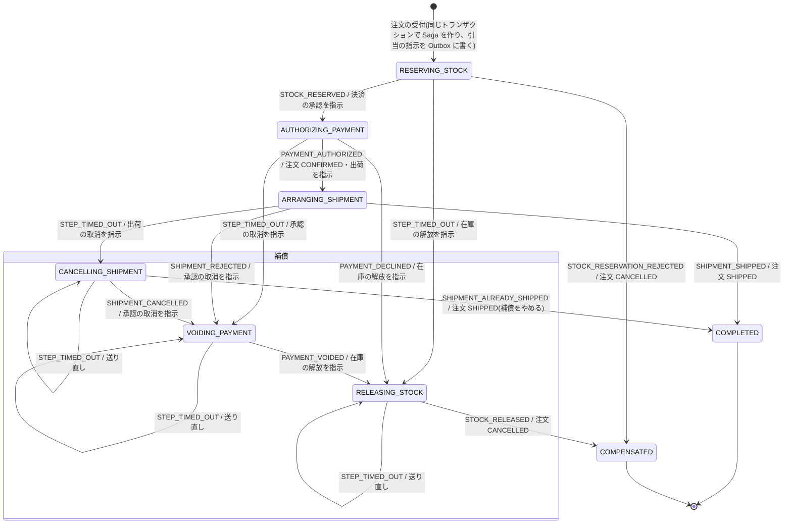

# 注文 Saga の状態遷移(order-service が Orchestrator)

注文の受付の後に、在庫の引当 → 決済の承認 → 出荷を、各サービスのローカルなトランザクションとコマンドでつなぐ(Framework 4.2・13。2PC は使わない)。
設計の理由は ADR-0029。domain の `OrderSagaRules.transitions` と、この文書の「遷移表」は一致させる(`OrderSagaDocSpec` で照合する)。
注文の状態(`OrderStatus`)の遷移は `docs/architecture/order-state-machine.md`。Saga の状態は、注文とは別に `order_saga` 表で持つ。

## 状態遷移図

## 遷移表
各段に入るときに、その段のコマンドを送る(`RESERVING_STOCK` → 在庫の引当、`AUTHORIZING_PAYMENT` → 決済の承認、`ARRANGING_SHIPMENT` → 出荷の手配、
`CANCELLING_SHIPMENT` → 出荷の取消、`VOIDING_PAYMENT` → 決済の承認の取消、`RELEASING_STOCK` → 在庫の解放)。

| 遷移元 | 受け取るもの | 遷移先 | 注文の状態 | 補償の理由 |
|---|---|---|---|---|
| `RESERVING_STOCK` | `STOCK_RESERVED` | `AUTHORIZING_PAYMENT` | — | — |
| `RESERVING_STOCK` | `STOCK_RESERVATION_REJECTED` | `COMPENSATED` | `CANCELLED` | `STOCK_UNAVAILABLE` |
| `RESERVING_STOCK` | `STEP_TIMED_OUT` | `RELEASING_STOCK` | — | `TIMED_OUT` |
| `AUTHORIZING_PAYMENT` | `PAYMENT_AUTHORIZED` | `ARRANGING_SHIPMENT` | `CONFIRMED` | — |
| `AUTHORIZING_PAYMENT` | `PAYMENT_DECLINED` | `RELEASING_STOCK` | — | `PAYMENT_DECLINED` |
| `AUTHORIZING_PAYMENT` | `STEP_TIMED_OUT` | `VOIDING_PAYMENT` | — | `TIMED_OUT` |
| `ARRANGING_SHIPMENT` | `SHIPMENT_SHIPPED` | `COMPLETED` | `SHIPPED` | — |
| `ARRANGING_SHIPMENT` | `SHIPMENT_REJECTED` | `VOIDING_PAYMENT` | — | `SHIPMENT_REJECTED` |
| `ARRANGING_SHIPMENT` | `STEP_TIMED_OUT` | `CANCELLING_SHIPMENT` | — | `TIMED_OUT` |
| `CANCELLING_SHIPMENT` | `SHIPMENT_CANCELLED` | `VOIDING_PAYMENT` | — | — |
| `CANCELLING_SHIPMENT` | `SHIPMENT_ALREADY_SHIPPED` | `COMPLETED` | `SHIPPED` | — |
| `VOIDING_PAYMENT` | `PAYMENT_VOIDED` | `RELEASING_STOCK` | — | — |
| `RELEASING_STOCK` | `STOCK_RELEASED` | `COMPENSATED` | `CANCELLED` | — |

- **補償の段の期限切れ**(`CANCELLING_SHIPMENT` / `VOIDING_PAYMENT` / `RELEASING_STOCK` で `STEP_TIMED_OUT`): 状態を変えずに、同じコマンドを送り直す。補償は必ず終える(回数の上限はなく、上限を超えた回数はアラートにする。ADR-0029 §3)。
- **表にない組み合わせ**(重複・期限切れの後に遅れて届いた前の段の結果・終端の後の結果)は **無視する**。At-Least-Once の重複と、期限切れとの競合を吸収する。参加者の側は「取消済み」の印で整合をとる(ADR-0029 §5)。
  - 例: 在庫の引当の期限切れで `RELEASING_STOCK` に入った後に `STOCK_RESERVED` が届いても無視する。在庫の解放の指示は、引当が先なら解放し、後なら印を残して後の引当を拒否するので、在庫は残らない。
  - 例: `CANCELLING_SHIPMENT` の間に `SHIPMENT_SHIPPED` が届いても無視する。出荷の取消の結果が `ALREADY_SHIPPED` で届くので、それで完了に進む。
- 受け取るものと契約の対応: `SHIPMENT_CANCELLED` は `shipping.shipment.cancelled.v1` の `outcome` が `CANCELLED` / `NOT_ARRANGED`、`SHIPMENT_ALREADY_SHIPPED` は `ALREADY_SHIPPED`。ほかは同名のイベント(`inventory.stock.reserved.v1` → `STOCK_RESERVED` など)。`outcome` / `reason` が `UNKNOWN`(読み手の知らない値)のときは判定できないので DLQ に送る(ADR-0028 §2)。

## 補償の順序
補償は **前進の逆の順に、1 つずつ** 行う(出荷の取消 → 決済の承認の取消 → 在庫の解放)。前の補償の結果を受け取ってから、次の補償を送る。
- 出荷は取り消せないことがある(すでに出荷した)。出荷の取消の結果を待ってから決済を取り消すことで、「出荷したのに代金を取り消した」状態を作らない。出荷済みなら、補償をやめて完了に進む。
- 決済の承認の取消と在庫の解放は、相手が何も持っていなくても成功で答える(`NOT_AUTHORIZED` / `NOT_RESERVED`)。期限切れでは、相手が処理したかどうか分からないため、必ず補償を送る。

## 期限(タイムアウト)
- 各段に入るときに、その段の期限を **DB の時計**(`clock_timestamp()`)で `order_saga` に記録する。期限切れの判定も DB の時計で行う(アプリのインスタンスの時計のずれで判定がずれないようにする。P05 の冪等のリースと同じ理由。ADR-0029 §6)。
- 期限切れの検出は、order-service の定期のジョブが `FOR UPDATE SKIP LOCKED` で行う(複数のインスタンスで同じ Saga を二重に処理しない)。

## 監視
| メトリクス(Prometheus の名前) | 意味 |
|---|---|
| `eia_saga_transitions_total{from,to,failure}` | 状態の遷移の件数(`failure` は補償の理由。なければ `none`) |
| `eia_saga_resends_total{state}` | 補償のコマンドを送り直した回数 |
| `eia_saga_stalled_total{state}` | 送り直しの回数が上限(`ORDER_SAGA_STALL_AFTER_RESENDS`。既定 5)を超えた後の送り直し。アラート `OrderSagaCompensationStalled` |
| `eia_saga_ignored_total{state,signal}` | 今の段に関係しない結果を無視した件数(重複・期限切れの後に遅れて届いた結果) |

返信の受信は Consumer Group `order.saga`(`eia_consumer_*`。ADR-0028)。ダッシュボードは Grafana の **Order — Saga**(`infra/local/grafana/provisioning/dashboards/eiaf/order-saga.json`)。対応は `docs/runbooks/order-saga.md`。

補償の流れ(在庫不足・決済の失敗・出荷の拒否・タイムアウト)は E2E の `tests/e2e/.../SagaE2E.kt` で確かめる。

## 注文の状態との対応
| Saga の状態 | 注文の状態 |
|---|---|
| `RESERVING_STOCK`・`AUTHORIZING_PAYMENT` | `PLACED` |
| `ARRANGING_SHIPMENT` | `CONFIRMED` |
| `COMPLETED` | `SHIPPED` |
| `CANCELLING_SHIPMENT`・`VOIDING_PAYMENT`・`RELEASING_STOCK`(補償中) | 補償に入る前のまま(`PLACED` または `CONFIRMED`) |
| `COMPENSATED` | `CANCELLED`(`sales.order.cancelled.v1` を発行する) |

- 注文の状態の遷移と Saga の状態の遷移は、同じトランザクションで書く。次の段のコマンドも、同じトランザクションで Outbox に書く(ADR-0007)。
