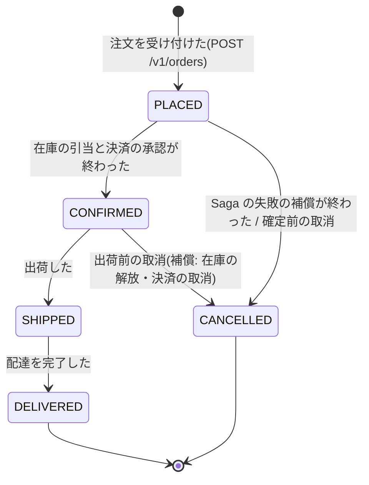

# 注文の状態遷移(order-service)

注文(`io.eia.order.domain.Order`)の状態と遷移の規則。domain の `OrderStatus.allowedTransitions` と、この表は一致させる(`OrderStateMachineDocSpec` で照合する)。
P07 の Saga(在庫の引当・決済・出荷)は、この遷移を呼び出す側になる。Saga の内部の状態は、注文の状態とは別に saga テーブルで持つ。

## 状態遷移図

## 遷移表
| 遷移元 | 遷移先 | きっかけ(P07 以降) |
|---|---|---|
| `PLACED` | `CONFIRMED` | Saga が在庫の引当と決済の承認を終えた |
| `PLACED` | `CANCELLED` | Saga の失敗(在庫不足・決済の失敗・タイムアウト)の補償が終わった、または確定前の取消 |
| `CONFIRMED` | `SHIPPED` | 出荷した |
| `CONFIRMED` | `CANCELLED` | 出荷前の取消(補償として、在庫の解放と決済の取消を行う) |
| `SHIPPED` | `DELIVERED` | 配達を完了した |

- `DELIVERED` と `CANCELLED` は終端で、ここからは遷移しない。
- 表にない遷移は `ConflictError`(API では 409 `conflict`)。

## 同じ状態への遷移(NoOp)
- `Order.transitionTo(next)` は、状態が変わった(`Transition.Applied`)か、すでにその状態で何もしなかった(`Transition.NoOp`)かを区別して返す。
- At-Least-Once で同じイベントやコマンドが重複して届いても、同じ状態への遷移は成功として扱う(消費側の冪等。`processed_message` と二重に守る)。
- **NoOp のときは、状態変更のイベントを発行しない**(P06 の Outbox に行を書かない)。重複したイベントを下流に流さないため。`Applied` のときだけ、業務の更新と同じトランザクションで Outbox に書く(ADR-0007・ADR-0022 §3)。

## 同時の遷移(楽観的ロック)
- 注文は楽観的ロック用の版(`Order.version`)を持つ。domain は値を運ぶだけで、版を増やすのと衝突の検出は永続化(P05 ④a)が行う(保存のときに、読んだ版と DB の版が一致しなければ失敗させる)。
- 同時の遷移(Saga の確定と利用者の取消など)は、④a の楽観的ロックで片方を失敗させる。**失敗した側は最新の状態を読み直し、この遷移表で判定し直す。**
  - 例: 取消(`PLACED → CANCELLED`)が先に確定した後、Saga の確定(`PLACED → CONFIRMED`)は版の衝突で失敗する。読み直すと `CANCELLED` なので、`CANCELLED → CONFIRMED` は表になく `ConflictError` になり、Saga は補償(在庫の解放・決済の取消)に進む。
  - 例: 同じ取消が 2 回届いた場合、後の側は読み直すと `CANCELLED` なので NoOp になり、イベントを発行しない。

## 状態変更のイベント
| 遷移 | イベント(トピック) | 契約 |
|---|---|---|
| 受け付け(`[*] → PLACED`) | `sales.order.created.v1` | `contracts/asyncapi/order-events.v1.yaml`(INT-SALES-002) |
| `→ CANCELLED` | `sales.order.cancelled.v1` | 同上 |
| `→ CONFIRMED` / `→ SHIPPED` / `→ DELIVERED` | 未定 | 必要になるフェーズ(P07 以降)で、先に契約に追加する(Contract First) |

## Saga の状態との対応(見込み。P07 で確定する)
| Saga の状態 | 注文の状態 |
|---|---|
| 開始・在庫の引当中・決済の承認中 | `PLACED` |
| 完了(在庫の引当済み・決済の承認済み) | `CONFIRMED` |
| 補償中 | `PLACED` のまま(補償が終わってから `CANCELLED`) |
| 補償済み | `CANCELLED` |
