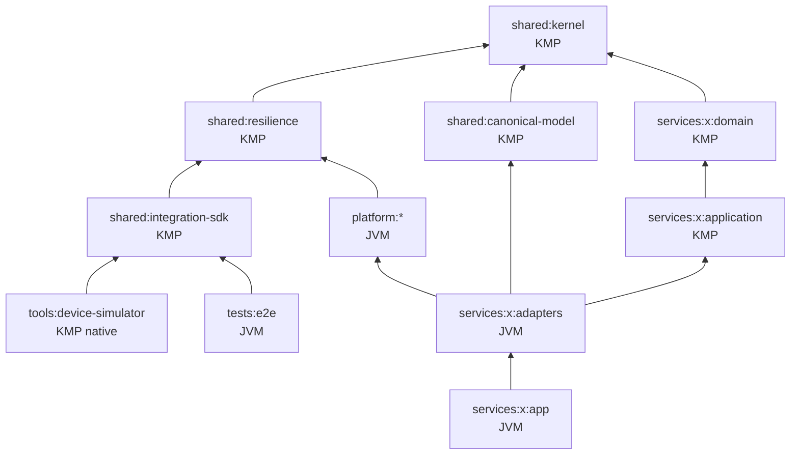

# Module Design

## 1. Gradle モジュール命名
`:shared:kernel`, `:shared:resilience`, `:shared:canonical-model`, `:shared:integration-sdk`
`:platform:<name>`, `:services:<service>:{domain,application,adapters,app}`, `:tools:<name>`
`:tools:device-simulator`(KMP: linuxX64 / macosArm64 の実行バイナリ)、`:tests:e2e`(JVM。`e2eTest` タスク。通常の build には含めない)
パッケージ(basePackage は ADR-0001 で決定。既定 `io.eia`):

| 対象 | パッケージ | 例 |
|---|---|---|
| `services/<service>/<layer>` | `<basePackage>.<service>.<layer>`(`<service>` はディレクトリ名から `-` を除いた値) | `io.eia.order.domain`, `io.eia.legacysim.app`(services/legacy-sim) |
| `shared/<module>` | `<basePackage>.shared.<module>` | `io.eia.shared.kernel`, `io.eia.shared.kernel.money` |
| `shared/canonical-model` | `<basePackage>.shared.canonical.<domain>`(ドメイン単位: common / sales / catalog / billing / logistics。ADR-0011) | `io.eia.shared.canonical.sales` |
| `platform/<module>` | `<basePackage>.platform.<module>` | `io.eia.platform.observability` |
| `tools/<module>` | `<basePackage>.tools.<module>` | `io.eia.tools.architecture` |

Konsist はパッケージでレイヤを判定するため、配置(`services/<service>/<layer>/`)とパッケージの一致も検査する(ADR-0010)。
Kotlin のパッケージ名に `-` は使えないため、サービスのパッケージはディレクトリ名から `-` を除く(`ArchitectureRules.servicePackage`。`platform/messaging-kafka` → `messagingkafka` と同じ規則)。

ターゲット構成と JVM 専用ライブラリの配置は ADR-0004 に従う。

| モジュール | 種別 | ターゲット |
|---|---|---|
| `shared/kernel`, `shared/resilience`, `shared/canonical-model`, `shared/integration-sdk` | KMP | jvm, js(IR), linuxX64, macosArm64 |
| `services/*/domain`, `services/*/application` | KMP(commonMain) | jvm のみ(`eia.kmp-domain` の DSL で追加可能) |
| `tools/device-simulator` | KMP | linuxX64, macosArm64 |
| `platform/*`, `services/*/{adapters,app}`, `tools/*`(上記以外), `tests/e2e` | JVM | — |

## 2. 依存関係

- `platform:*` は `services:*` に依存しない。
- `services:*:domain` と `services:*:application` は `shared:canonical-model` に依存しない。domain はサービス独自のモデルとし、Canonical Model との変換は adapters で行う(ADR-0010 Decision 7。Konsist の `canonicalModelOutsideDomainAndApplication`)。
- `platform` のモジュール間の本番の依存(import・完全修飾名・`api` / `implementation` などの宣言)は、次の一覧だけを許可し、循環を禁止する(Konsist の `PlatformDependencyRules`)。テストのソースセットと `testImplementation` などの依存は対象外。一覧を変えるときは、`PlatformDependencyRules.ALLOWED` とこの表を同時に更新する。

  | 依存元 | 依存先 | 理由 |
  |---|---|---|
  | `platform:audit` | `platform:security` | S3 の資格情報を `SecretProvider` から取る(ADR-0008・ADR-0019 §6) |
  | `platform:audit` | `platform:observability` | details の値のマスキング(ADR-0018 §3) |
  | `platform:security` | `platform:reliability` | トークンの取得の Retry・Circuit Breaker、`Retry-After` の解析(ADR-0019 §4・ADR-0021 §11) |
  | `platform:security` | `platform:api` | 401 / 403 / 503 を Problem Details で返す(ADR-0019 §5・ADR-0022 §2) |
  | `platform:api` | `platform:observability` | Problem Details の `correlationId`(ADR-0022 §2) |
  | `platform:messaging-kafka` | `platform:schema-registry` | 書き込みのスキーマ ID(起動時に解決したもの)と受信時の書き手のスキーマ(ADR-0025 §3) |
  | `platform:messaging-kafka` | `platform:observability` | PRODUCER の span と Correlation ID(ADR-0025 §4・ADR-0018 §2) |
  | `platform:outbox` | `platform:messaging-kafka` | 記録のトピック・ヘッダ・ペイロード(`EventTopic`・`EventMetadata`・`AvroEventSerializer`。ADR-0007) |
  | `platform:outbox` | `platform:observability` | 記録を作るときの PRODUCER の span と Correlation ID(ADR-0018 §2) |
- Kafka のクライアントと avro4k を本番コードで使ってよいのは `platform:messaging-kafka` と `services:*:adapters`・`app` だけ(`org.apache.avro` は tools も可)。Apicurio の公式のライブラリはテストだけ(ADR-0025 §5。Konsist の `messagingLibrariesOnlyInAllowedModules`)。
- `platform:test-support` はテストのソースセット(`test` / `integrationTest` など)からだけ参照する。
- `services` 間のコード依存は禁止(連携は契約経由のみ)。契約モデルは contracts から生成するか `adapters` 内で定義する。
- `tests:e2e` は `services:*` にコード依存しない(契約・SDK・公開エンドポイント経由のみで検証する)。P05 の時点では SDK(P11)がないため、JDK の HttpClient で公開エンドポイント(Gateway・Keycloak・Tempo・Prometheus・Grafana)に接続する。ソースは `src/e2eTest/kotlin`、実行は `make e2e`(起動した基盤に対して)と ci の `e2e` ジョブ。
- `tools:device-simulator` は `shared:integration-sdk` にのみ依存する。

## 3. サービス内部レイアウト(例: order)
```
services/order/
  domain/src/commonMain/kotlin/io/eia/order/domain/          # package io.eia.order.domain
    Order.kt, OrderLine.kt, OrderStatus.kt, Identifiers.kt, ShippingAddress.kt   # 状態遷移は docs/architecture/order-state-machine.md
    OrderSaga.kt(Saga の状態・受け取るもの・遷移表 OrderSagaRules。純粋な関数。docs/architecture/order-saga.md・ADR-0029)
  application/src/commonMain/kotlin/io/eia/order/application/ # package io.eia.order.application
    port/inbound/PlaceOrderUseCase.kt          # `in` は Kotlin の予約語のため inbound / outbound とする
    port/outbound/OrderRepository.kt(楽観的ロック), TransactionRunner.kt, OrderIdGenerator.kt, OrderAuditTrail.kt, OrderEventOutbox.kt(P06。Outbox でイベントを書く)   # IdempotencyStore は platform/api(ADR-0022 §1)
    usecase/PlaceOrderService.kt, GetOrderService.kt
  adapters/src/main/kotlin/io/eia/order/adapters/             # package io.eia.order.adapters
    inbound/rest/OrderRoutes.kt, OrderDtos.kt, OrderDtoMapper.kt, OrderProblems.kt   # `in` は予約語(ktlint はバッククォートのパッケージ名を許さない)
    out/persistence/ExposedOrderRepository.kt, ExposedTransactionRunner.kt, OrderSchema.kt(order と監査のマイグレーション),
                    UuidV7OrderIdGenerator.kt, PostgresIdempotencyStore.kt, ExposedTransactionBoundary.kt(冪等。ADR-0022 §3),
    out/outbox/OutboxOrderEvents.kt(OrderEventOutbox の実装)、OrderEventMapper.kt(domain → Canonical Model → イベントの型)、
                    OrderCreatedV1.kt(契約の record 名の @SerialName。ADR-0025 §1)、OrderEventSchemas.kt(トピックと、contracts からコピーした契約のスキーマ)
  adapters/src/main/resources/db/order/                       # Flyway(所有者のロールで適用。アプリのロールには必要な権限だけを付ける)
  app/src/main/kotlin/io/eia/order/app/                       # package io.eia.order.app
    Main.kt(migrate / serve), OrderCommands.kt, OrderServer.kt(Netty), OrderModule.kt(Koin), OrderConfig.kt   # ADR-0024
    ServerTls.kt(PEM の鍵と証明書・有効期限), ClientCertificateAllowList.kt(SAN の許可の一覧), TlsRoutes.kt(ポートの分け方)   # ADR-0024 §6
  app/Dockerfile                                              # distroless の nonroot。ADR-0024 §7
```

**例外: レガシーの模擬(`services/legacy-sim`)は `app` の 1 モジュールだけ**(ADR-0026 §1)。改修できないレガシーの模擬で、業務のロジックを持たず、表のマイグレーション(`db/legacy`。V1 はレガシーの表、V2 は DBA の CDC の設定)と、レガシーのアプリの操作(`simulate`)だけを持つ。変換の知識(Anti-Corruption Layer)は持たない。ACL は連携する側の別のサービス(`services/legacy-order-acl`。4 モジュール。P06 ⑤b)に置く。理由は ADR-0026 §1(ACL は連携する側の責務で、改修できないレガシーには置けない。Framework 8.3 は CDC と変換を別の段に分ける)。
```
services/legacy-sim/app/
  src/main/kotlin/io/eia/legacysim/app/   Main.kt(migrate / simulate), LegacySimCommands.kt, LegacySimConfig.kt, LegacySchema.kt(Flyway), LegacyJuchuApp.kt(レガシーのアプリの模擬)
  src/main/resources/db/legacy/           V1__legacy_schema.sql(t_juchu), V2__dba_cdc_setup.sql(REPLICA IDENTITY FULL・権限・signal 表・publication)
  src/integrationTest/                     LegacyCdcIT(legacy-sim → Debezium → 生の CDC のトピック)
  Dockerfile                               migrate / simulate(make up PROFILE=cdc・make legacy-simulate)
```

**永続化の方針**(全サービスで揃える):
- Exposed はトランザクションの管理に使い、ロックの意味が重要な SQL(楽観的ロック、`ON CONFLICT` など)は PreparedStatement で直接書く(`platform/audit` と同じ書き方。ADR-0017)。
- マイグレーションは DB の所有者のロール(`{service}`)で適用し、アプリはマイグレーションが権限を付けたロール(`{service}_app`。所有者の権限を持たない)で接続する。監査の表(`AuditSchema`)も同じ DB に適用する。
- SQL の例外は SQLSTATE で Retryable / NonRetryable に分類し、ドライバのメッセージ(行の値を含みうる)はエラーに入れない。

## 3.1 Gradle 以外のディレクトリ
| パス | 内容 | 命名 |
|---|---|---|
| `contracts/files/` | ファイル I/F 仕様・manifest スキーマ・EDI サブセット定義 | `{system}_{dataset}.v{n}.yaml`, `manifest.v1.schema.json`, `edi/edifact-orders.v1.yaml` |
| `docs/runbooks/` | アラートに紐づく運用手順(Framework 13.1・14.1) | `{channel}-{operation}.md` 例: `event-dlq-replay.md` |
| `docs/reports/` | DoD の証跡となる計測・検証結果 | `{phase}-{topic}.md` 例: `p14-resilience.md` |

## 4. サービス・プラットフォーム一覧
| サービス | 役割 | 主な連携方式 |
|---|---|---|
| order | 受注 API・Saga Orchestrator | REST, Outbox/CDC, Kafka |
| inventory | 在庫引当 | Kafka Consumer, gRPC |
| payment | 決済(モック) | Kafka |
| shipping | 出荷 | Kafka |
| legacy-sim | レガシー基幹 DB 模擬(改修できないレガシー。表と `simulate` だけ。1 モジュール。ADR-0026) | CDC(生の CDC のトピック `_cdc.legacy.*`) |
| legacy-order-acl | レガシーの受注の CDC の Anti-Corruption Layer(状態を持たない変換・DLQ。P06 ⑤b。ADR-0026)。4 モジュール。domain に変換の規則(`LegacyOrderTranslation`)、application にユースケースと発行の Port、adapters に Debezium の Envelope の型・読み取りのループ(`LegacyChangeConsumer`。At-Least-Once)・発行(`KafkaLegacyOrderStatePublisher`)、app に起動とヘルスチェック。照合(P06 ⑥。ADR-0027): domain に `LegacyOrderFingerprint`、application に `ReconcileLegacyOrdersUseCase` と Port(`LegacySource`・`PublishedLegacyOrders`)、adapters に `reconcile/`(`JdbcLegacySource`・`KafkaPublishedLegacyOrders`・`ReconcileMetrics`)、app に定期の照合(`ReconcileJob`)と `reconcile` のサブコマンド。再同期(P06 ⑥b): application に `ResyncLegacyOrdersUseCase`(上限 100 件)、adapters に `JdbcSnapshotRequests`(signal 表)・`KafkaReconcileTombstones`(照合の tombstone)。レガシーの DB は読み取り専用のロールで読む(ADR-0027 §1 の例外) | CDC → Kafka(`sales.legacy-order.changed.v1`。INT-SALES-003) |
| batch-etl | 分析基盤への ELT/ETL | Batch |
| file-exchange | ファイル授受 | MFT (S3 互換ストレージ/SFTP) |
| saas-mock / webhook-receiver / integration-flow | SaaS 連携 | REST, Webhook |
| iot-bridge | MQTT→Kafka | MQTT, Kafka |
| b2b-gateway | EDI | SFTP, EDIFACT |
| bff-graphql | フロント集約 | GraphQL |

| platform | 役割 | フェーズ |
|---|---|---|
| observability | OTel の初期化・Ktor の Server / Client プラグイン(traceparent・Correlation ID の伝搬、RED メトリクス)・構造化 JSON ログ・マスキング(ADR-0018)。OTel SDK を使ってよいのはこのモジュールと `services/*/app` だけ(ADR-0004 §4。Konsist) | P04a |
| security | JWT の検証(JWKS)・スコープの認可(`eiaJwt` / `requireScopes`)・Client Credentials のトークン取得・`SecretProvider`(ADR-0008・ADR-0019)。Nimbus JOSE+JWT を使ってよいのはこのモジュールだけ(Konsist) | P04a |
| audit | 監査記録: 追記専用のテーブル(アプリ用のロールは INSERT / SELECT だけ。トリガーでも拒否)とハッシュチェーン、S3 互換ストレージの Object Lock(COMPLIANCE)へのアンカー、チェーンとアンカーの検証(ADR-0017)。検査は `tools/audit-verify`(`make audit-verify`)。`java.time` と `java.sql` を使う JVM の部品なので、services の application に Port(例 `AuditTrail`)を置き、adapters で `AuditLog.appendAudit`(業務と同じ Exposed のトランザクション)に写す | P04a |
| test-support | テスト専用。`infra/local/images.env` のイメージを Testcontainers で使う `InfraImages`(ADR-0016 §5)と、compose と同じ構成のコンテナ(`SeaweedFsContainer`・`ApicurioRegistryContainer`・`KafkaConnectContainer`。Connect のイメージは docker の CLI で組み立てる)。test / integrationTest からだけ参照する(Konsist) | P04a |
| api | REST の共通部品: Problem Details(RFC 9457。`installProblemDetails` / `respondError`。`type` の一覧は INTEGRATION_STANDARDS §6)と Idempotency-Key(`respondIdempotently` / `IdempotencyHandler` / Port `IdempotencyStore`。PostgreSQL の実装は各サービスの adapters)(ADR-0022) | P05 |
| reliability | `shared/resilience` の JVM 向けアダプタ: OTel のメトリクス(`ResilienceMetrics`)、Ktor Client の結果の Retryable / NonRetryable への分類(`HttpCallClassifier`)、`Retry-After` の解析(ADR-0021 §7・§11)。OTel は API だけを使う | P04b |
| inbox | 冪等消費の記録(ADR-0028 §3)。`Inbox.markProcessed` / `markProcessedIn`(業務と同じ Exposed のトランザクションで `inbox.processed_message` に `(consumer_group, ce_id)` を `INSERT ... ON CONFLICT DO NOTHING`。重複なら `DUPLICATE`。自動コミットでは書かない)、`Inbox.purgeExpired`(DB の時計で保持期間(既定 14 日)を過ぎた行を古い順に消す)、`InboxSchema`(スキーマ `inbox`・権限。サービスの migrate で所有者が適用する)。Kafka にも他の platform にも依存しない | P07 |
| outbox | Transactional Outbox(ADR-0007)。`Outbox.append` / `appendOutbox`(業務と同じ Exposed のトランザクションで INSERT し、同じ行を DELETE する既定の方式。自動コミットでは書かない)、`OutboxEvents`(イベントから記録を作る。`{topic} create` の PRODUCER の span・UUIDv7 の `ce_id` = `id`)、`OutboxSchema`(スキーマ `outbox`・権限・publication `eiaf_outbox`。サービスの migrate で所有者が適用する)、`OutboxMetrics`。保持期間の方式は #76 | P06 |
| messaging-kafka | Kafka の共通部品(ADR-0025)。P06: CloudEvents binary mode のヘッダ(`EventMetadata`)・トピック名(`EventTopic`)・Avro の Serde(avro4k。スキーマ ID は Apicurio と同じ形式でペイロードの先頭に埋め込む。`ApicurioWireFormat`・`AvroEventSerializer`・`AvroEventDeserializer`)・DB の更新を伴わない送信の Producer(`EventProducer`。PRODUCER の span)。DB の更新と組み合わせるイベントは Outbox で発行する。tombstone(`EventProducer.sendTombstone`)と DLQ(`DeadLetterPublisher`。`{topic}.dlq`・`eiaf.dlq.*` のヘッダ。INTEGRATION_STANDARDS §2)は P06 ⑤b(最初の利用者は legacy-order-acl)。P07: 型付きの Consumer(`EventConsumer`・`EventSubscription`・`EventHandler`。パーティションごとに届いた順に処理し、処理の後にコミットする At-Least-Once。失敗の種類(`HandlingFailure`: Rejected → DLQ・Transient → 初回 + 3 回のリトライの後に DLQ・Unavailable → DLQ に送らず読み直す)。CONSUMER の span・`ConsumerMetrics`。ADR-0028)。冪等消費の記録は `platform/inbox`。DLQ の Replay(`DeadLetterReplayer`。既定は dry-run・件数の上限は必須・`ce_id` を変えずに元のトピックへ・生の CDC の DLQ は拒否。CLI は `tools/dlq-replay`。ADR-0028 §6) | P06, P07 |
| batch | 軽量 DAG ランナー・Checkpoint・SLA メトリクス | P08 |
| file-transfer | manifest・checksum・S3 互換ストレージ / SFTP | P09 |
| schema-registry | Apicurio Registry 3 の REST クライアント(`ApicurioRegistryClient`: 内容からの contentId の解決・ID からのスキーマの取得・登録)、起動時のスキーマ ID の解決(`SchemaIdBook`。リクエストの処理中はレジストリに問い合わせず、未解決の間は `/health/ready` を失敗にする)、書き手のスキーマのキャッシュ(`WriterSchemas`)(ADR-0025 §2・§3)。契約の登録は `tools/schema-publish`(`make schemas`)だけが行い、サービスは自動登録しない | P06 |

## 5. テスト戦略
| レベル | 対象 | ツール |
|---|---|---|
| Unit | domain / application(Port はフェイク) | kotest (commonTest) |
| Architecture | 依存方向・命名・レイヤ規約・禁止 import・`kotlin.Result` 禁止 | Konsist |
| Contract | 契約 ⇔ 実装の一致、互換性、Canonical ⇔ Avro | tools/contract-check, OpenAPI validator |
| Integration | Adapter ⇔ 実ミドルウェア | Testcontainers |
| E2E / Chaos | シナリオ・障害注入 | tests/e2e (kotest) + docker compose + Toxiproxy |

### 5.1 カバレッジ(Kover)の測り方(Issue #56)
| 対象 | 計測に使うテスト | 閾値の検証 |
|---|---|---|
| 統合テストを持たないモジュール(domain・application・kernel など) | 単体テスト | `./gradlew build`(必須のチェック)で強制する |
| 統合テストを持つモジュール(`src/integrationTest` がある adapters・platform の一部)と、ルートの全体の集約 | 単体テスト + 統合テスト(`integrationTest` で実行された本番コード) | CI の `integration` ジョブ(`./gradlew integrationTest koverVerify -Peia.kover.withIntegrationTests=true`)で強制する。`./gradlew build` では統合テストを動かさず、単体テストだけの値を目安(警告)として出す |

- 閾値は CODING_STANDARDS のとおり(domain / application 90%、それ以外と全体 75%)。統合テストのテストクラス自体は計測の対象外。
- 理由: adapters の本当の検証は、実際のミドルウェアでの統合テスト(Testcontainers)である。単体テストだけで測ると、閾値を満たすために SQL の呼び出しをモックで模しただけのテストが要り、価値が低い割に保守が増える(P05 ④a-1・#55 の経緯)。一方で、`build` で統合テストを毎回動かすと、Docker が要り、build が遅くなる。
- adapters の単体テストは、統合テストで再現できない分岐(並行の削除との競合など)と、DB を使わない純粋な処理(SQL のエラーの分類・ID の採番など)だけに使う。
- `integration` ジョブは、統合テストに関係する変更(ci.yml の paths-filter)があるときだけ動く。動かない PR では、統合テストを持つモジュールの閾値は検証されない(そのモジュールを変えていないため)。
