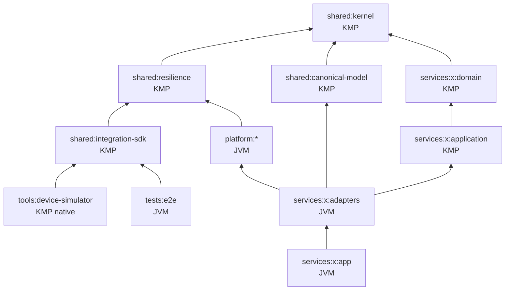

# Module Design

## 1. Gradle モジュール命名
`:shared:kernel`, `:shared:resilience`, `:shared:canonical-model`, `:shared:integration-sdk`
`:platform:<name>`, `:services:<service>:{domain,application,adapters,app}`, `:tools:<name>`
`:tools:device-simulator`(KMP: linuxX64 / macosArm64 の実行バイナリ)、`:tests:e2e`(JVM。`e2eTest` タスク。通常の build には含めない)
パッケージ(basePackage は ADR-0001 で決定。既定 `io.eia`):

| 対象 | パッケージ | 例 |
|---|---|---|
| `services/<service>/<layer>` | `<basePackage>.<service>.<layer>` | `io.eia.order.domain`, `io.eia.order.adapters` |
| `shared/<module>` | `<basePackage>.shared.<module>` | `io.eia.shared.kernel`, `io.eia.shared.kernel.money` |
| `shared/canonical-model` | `<basePackage>.shared.canonical.<domain>`(ドメイン単位: common / sales / catalog / billing / logistics。ADR-0011) | `io.eia.shared.canonical.sales` |
| `platform/<module>` | `<basePackage>.platform.<module>` | `io.eia.platform.observability` |
| `tools/<module>` | `<basePackage>.tools.<module>` | `io.eia.tools.architecture` |

Konsist はパッケージでレイヤを判定するため、配置(`services/<service>/<layer>/`)とパッケージの一致も検査する(ADR-0010)。

ターゲット構成と JVM 専用ライブラリの配置は ADR-0004 に従う。

| モジュール | 種別 | ターゲット |
|---|---|---|
| `shared/kernel`, `shared/resilience`, `shared/canonical-model`, `shared/integration-sdk` | KMP | jvm, js(IR), linuxX64, macosArm64 |
| `services/*/domain`, `services/*/application` | KMP(commonMain) | jvm のみ(`eia.kmp-domain` の DSL で追加可能) |
| `tools/device-simulator` | KMP | linuxX64, macosArm64 |
| `platform/*`, `services/*/{adapters,app}`, `tools/*`(上記以外), `tests/e2e` | JVM | — |

## 2. 依存関係

- `platform:*` は `services:*` に依存しない。
- `services:*:domain` と `services:*:application` は `shared:canonical-model` に依存しない。domain はサービス独自のモデルとし、Canonical Model との変換は adapters で行う(ADR-0010 Decision 7。Konsist の `canonicalModelOutsideDomainAndApplication`)。
- `platform` のモジュール間の本番の依存(import・完全修飾名・`api` / `implementation` などの宣言)は、次の一覧だけを許可し、循環を禁止する(Konsist の `PlatformDependencyRules`)。テストのソースセットと `testImplementation` などの依存は対象外。一覧を変えるときは、`PlatformDependencyRules.ALLOWED` とこの表を同時に更新する。

  | 依存元 | 依存先 | 理由 |
  |---|---|---|
  | `platform:audit` | `platform:security` | S3 の資格情報を `SecretProvider` から取る(ADR-0008・ADR-0019 §6) |
  | `platform:audit` | `platform:observability` | details の値のマスキング(ADR-0018 §3) |
  | `platform:security` | `platform:reliability` | トークンの取得の Retry・Circuit Breaker、`Retry-After` の解析(ADR-0019 §4・ADR-0021 §11) |
  | `platform:security` | `platform:api` | 401 / 403 / 503 を Problem Details で返す(ADR-0019 §5・ADR-0022 §2) |
  | `platform:api` | `platform:observability` | Problem Details の `correlationId`(ADR-0022 §2) |
- `platform:test-support` はテストのソースセット(`test` / `integrationTest` など)からだけ参照する。
- `services` 間のコード依存は禁止(連携は契約経由のみ)。契約モデルは contracts から生成するか `adapters` 内で定義する。
- `tests:e2e` は `services:*` にコード依存しない(契約・SDK・公開エンドポイント経由のみで検証する)。
- `tools:device-simulator` は `shared:integration-sdk` にのみ依存する。

## 3. サービス内部レイアウト(例: order)
```
services/order/
  domain/src/commonMain/kotlin/io/eia/order/domain/          # package io.eia.order.domain
    Order.kt, OrderLine.kt, OrderStatus.kt, Identifiers.kt, ShippingAddress.kt   # 状態遷移は docs/architecture/order-state-machine.md
  application/src/commonMain/kotlin/io/eia/order/application/ # package io.eia.order.application
    port/inbound/PlaceOrderUseCase.kt          # `in` は Kotlin の予約語のため inbound / outbound とする
    port/outbound/OrderRepository.kt(楽観的ロック), TransactionRunner.kt, OrderIdGenerator.kt, OutboxPort.kt(P06)   # IdempotencyStore は platform/api(ADR-0022 §1)
    usecase/PlaceOrderService.kt, GetOrderService.kt
  adapters/src/main/kotlin/io/eia/order/adapters/             # package io.eia.order.adapters
    in/rest/OrderRoutes.kt, OrderDtoMapper.kt
    out/persistence/ExposedOrderRepository.kt, ExposedOutbox.kt
  app/src/main/kotlin/io/eia/order/app/                       # package io.eia.order.app
    Main.kt, Modules.kt(Koin), Config.kt
```

## 3.1 Gradle 以外のディレクトリ
| パス | 内容 | 命名 |
|---|---|---|
| `contracts/files/` | ファイル I/F 仕様・manifest スキーマ・EDI サブセット定義 | `{system}_{dataset}.v{n}.yaml`, `manifest.v1.schema.json`, `edi/edifact-orders.v1.yaml` |
| `docs/runbooks/` | アラートに紐づく運用手順(Framework 13.1・14.1) | `{channel}-{operation}.md` 例: `event-dlq-replay.md` |
| `docs/reports/` | DoD の証跡となる計測・検証結果 | `{phase}-{topic}.md` 例: `p14-resilience.md` |

## 4. サービス・プラットフォーム一覧
| サービス | 役割 | 主な連携方式 |
|---|---|---|
| order | 受注 API・Saga Orchestrator | REST, Outbox/CDC, Kafka |
| inventory | 在庫引当 | Kafka Consumer, gRPC |
| payment | 決済(モック) | Kafka |
| shipping | 出荷 | Kafka |
| legacy-sim | レガシー基幹 DB 模擬 | CDC |
| batch-etl | 分析基盤への ELT/ETL | Batch |
| file-exchange | ファイル授受 | MFT (S3 互換ストレージ/SFTP) |
| saas-mock / webhook-receiver / integration-flow | SaaS 連携 | REST, Webhook |
| iot-bridge | MQTT→Kafka | MQTT, Kafka |
| b2b-gateway | EDI | SFTP, EDIFACT |
| bff-graphql | フロント集約 | GraphQL |

| platform | 役割 | フェーズ |
|---|---|---|
| observability | OTel の初期化・Ktor の Server / Client プラグイン(traceparent・Correlation ID の伝搬、RED メトリクス)・構造化 JSON ログ・マスキング(ADR-0018)。OTel SDK を使ってよいのはこのモジュールと `services/*/app` だけ(ADR-0004 §4。Konsist) | P04a |
| security | JWT の検証(JWKS)・スコープの認可(`eiaJwt` / `requireScopes`)・Client Credentials のトークン取得・`SecretProvider`(ADR-0008・ADR-0019)。Nimbus JOSE+JWT を使ってよいのはこのモジュールだけ(Konsist) | P04a |
| audit | 監査記録: 追記専用のテーブル(アプリ用のロールは INSERT / SELECT だけ。トリガーでも拒否)とハッシュチェーン、S3 互換ストレージの Object Lock(COMPLIANCE)へのアンカー、チェーンとアンカーの検証(ADR-0017)。検査は `tools/audit-verify`(`make audit-verify`)。`java.time` と `java.sql` を使う JVM の部品なので、services の application に Port(例 `AuditTrail`)を置き、adapters で `AuditLog.appendAudit`(業務と同じ Exposed のトランザクション)に写す | P04a |
| test-support | テスト専用。`infra/local/images.env` のイメージを Testcontainers で使う `InfraImages`(ADR-0016 §5)。test / integrationTest からだけ参照する(Konsist) | P04a |
| api | REST の共通部品: Problem Details(RFC 9457。`installProblemDetails` / `respondError`。`type` の一覧は INTEGRATION_STANDARDS §6)と Idempotency-Key(`respondIdempotently` / `IdempotencyHandler` / Port `IdempotencyStore`。PostgreSQL の実装は各サービスの adapters)(ADR-0022) | P05 |
| reliability | `shared/resilience` の JVM 向けアダプタ: OTel のメトリクス(`ResilienceMetrics`)、Ktor Client の結果の Retryable / NonRetryable への分類(`HttpCallClassifier`)、`Retry-After` の解析(ADR-0021 §7・§11)。OTel は API だけを使う | P04b |
| outbox | Outbox 挿入・削除・保持期間ジョブ | P06 |
| messaging-kafka | Producer(P06)/ Consumer・DLQ・Replay(P07) | P06, P07 |
| batch | 軽量 DAG ランナー・Checkpoint・SLA メトリクス | P08 |
| file-transfer | manifest・checksum・S3 互換ストレージ / SFTP | P09 |
| schema-registry | Apicurio クライアント・スキーマ ID キャッシュ | P06 |

## 5. テスト戦略
| レベル | 対象 | ツール |
|---|---|---|
| Unit | domain / application(Port はフェイク) | kotest (commonTest) |
| Architecture | 依存方向・命名・レイヤ規約・禁止 import・`kotlin.Result` 禁止 | Konsist |
| Contract | 契約 ⇔ 実装の一致、互換性、Canonical ⇔ Avro | tools/contract-check, OpenAPI validator |
| Integration | Adapter ⇔ 実ミドルウェア | Testcontainers |
| E2E / Chaos | シナリオ・障害注入 | tests/e2e (kotest) + docker compose + Toxiproxy |
