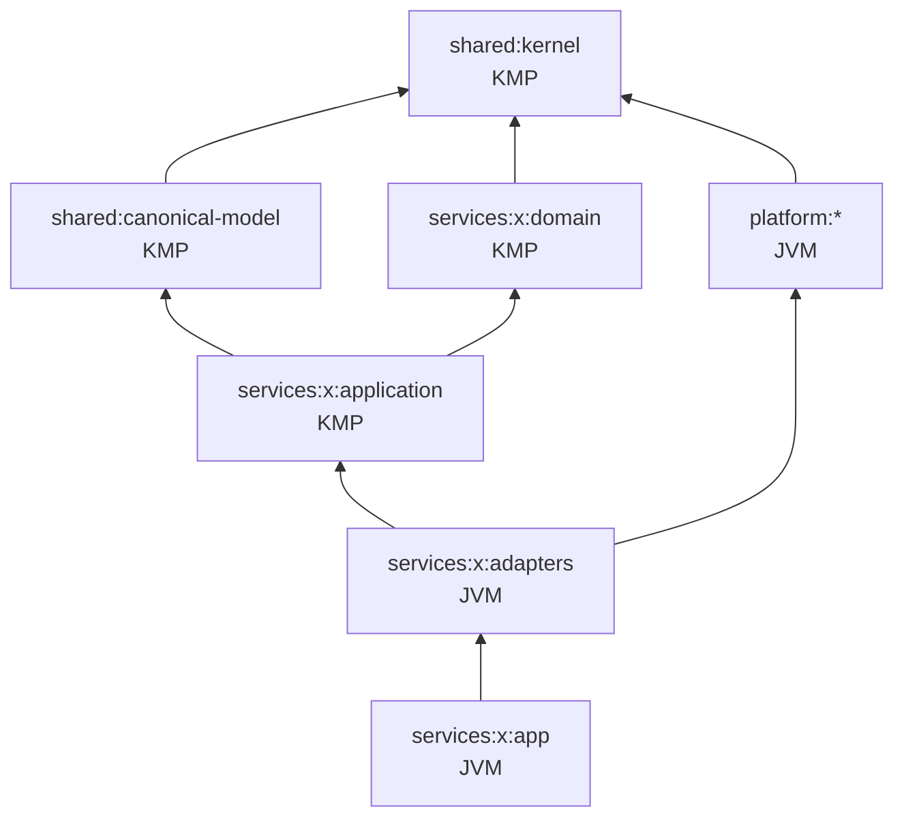

# Module Design

## 1. Gradle モジュール命名
`:shared:kernel`, `:shared:canonical-model`, `:shared:integration-sdk`
`:platform:<name>`, `:services:<service>:{domain,application,adapters,app}`, `:tools:<name>`
パッケージ: `<basePackage>.<layer>.<service>`(basePackage は ADR-0001 で決定。既定 `io.eia`)

## 2. 依存関係

- `platform:*` は `services:*` に依存しない。
- `services` 間のコード依存は禁止(連携は契約経由のみ)。契約モデルは contracts から生成するか `adapters` 内で定義。

## 3. サービス内部レイアウト(例: order)
```
services/order/
  domain/src/commonMain/kotlin/.../order/domain/
    Order.kt, OrderLine.kt, OrderStatus.kt, OrderEvent.kt, OrderPolicy.kt
  application/src/commonMain/kotlin/.../order/application/
    port/in/PlaceOrderUseCase.kt
    port/out/OrderRepository.kt, OutboxPort.kt, IdempotencyStore.kt, TransactionRunner.kt
    usecase/PlaceOrderService.kt
  adapters/src/main/kotlin/.../order/adapters/
    in/rest/OrderRoutes.kt, OrderDtoMapper.kt
    out/persistence/ExposedOrderRepository.kt, ExposedOutbox.kt
  app/src/main/kotlin/.../order/app/
    Main.kt, Modules.kt(Koin), Config.kt
```

## 4. サービス一覧
| サービス | 役割 | 主な連携方式 |
|---|---|---|
| order | 受注 API・Saga Orchestrator | REST, Outbox/CDC, Kafka |
| inventory | 在庫引当 | Kafka Consumer, gRPC |
| payment | 決済(モック) | Kafka |
| shipping | 出荷 | Kafka |
| legacy-sim | レガシー基幹 DB 模擬 | CDC |
| batch-etl | 分析基盤への ETL | Batch |
| file-exchange | ファイル授受 | MFT (MinIO/SFTP) |
| saas-mock / webhook-receiver / integration-flow | SaaS 連携 | REST, Webhook |
| iot-bridge | MQTT→Kafka | MQTT, Kafka |
| b2b-gateway | EDI | SFTP, EDIFACT |
| bff-graphql | フロント集約 | GraphQL |

## 5. テスト戦略
| レベル | 対象 | ツール |
|---|---|---|
| Unit | domain / application(Port はフェイク) | kotest (commonTest) |
| Architecture | 依存方向・命名・レイヤ規約 | Konsist |
| Contract | 契約 ⇔ 実装の一致、互換性 | tools/contract-check, OpenAPI validator |
| Integration | Adapter ⇔ 実ミドルウェア | Testcontainers |
| E2E / Chaos | シナリオ・障害注入 | docker compose + Toxiproxy |
